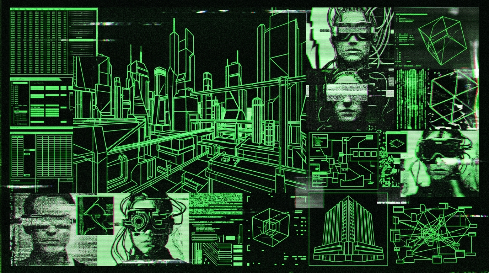

<div align="center">
<svg width="800" height="250" viewBox="0 0 800 250" xmlns="http://www.w3.org/2000/svg">
  <defs>
    <radialGradient id="node-glow" cx="50%" cy="50%" r="50%">
      <stop offset="0%" stop-color="#fff" stop-opacity="1"/>
      <stop offset="20%" stop-color="#00ffff" stop-opacity="0.8"/>
      <stop offset="100%" stop-color="#001122" stop-opacity="0"/>
    </radialGradient>
    <filter id="neon-glow" x="-50%" y="-50%" width="200%" height="200%">
      <feGaussianBlur stdDeviation="3" result="coloredBlur"/>
      <feMerge>
        <feMergeNode in="coloredBlur"/>
        <feMergeNode in="SourceGraphic"/>
      </feMerge>
    </filter>
  </defs>
  <rect width="800" height="250" fill="#01050a"/>
  <!-- ZIPF Curve in background -->
  <path d="M 50,230 L 50,50 Q 80,200 150,215 T 750,225" fill="none" stroke="#003366" stroke-width="2"/>
  <path d="M 50,230 L 50,50 Q 80,200 150,215 T 750,225" fill="none" stroke="#004488" stroke-width="1" transform="translate(0, 5)"/>
  
  <!-- Neural Net Connections -->
  <path d="M 400,125 L 200,60 M 400,125 L 250,180 M 400,125 L 550,70 M 400,125 L 600,190 M 200,60 L 250,180 M 550,70 L 600,190" stroke="#0088cc" stroke-width="1" opacity="0.6"/>
  <path d="M 400,125 L 480,30 M 400,125 L 320,220" stroke="#00aaff" stroke-width="1.5" filter="url(#neon-glow)"/>
  
  <!-- Glowing Nodes -->
  <circle cx="400" cy="125" r="40" fill="url(#node-glow)"/>
  <circle cx="200" cy="60" r="20" fill="url(#node-glow)"/>
  <circle cx="250" cy="180" r="15" fill="url(#node-glow)"/>
  <circle cx="550" cy="70" r="25" fill="url(#node-glow)"/>
  <circle cx="600" cy="190" r="18" fill="url(#node-glow)"/>
  <circle cx="480" cy="30" r="10" fill="url(#node-glow)"/>
  <circle cx="320" cy="220" r="12" fill="url(#node-glow)"/>
  
  <text x="355" y="130" font-family="monospace" font-size="14" fill="#000" font-weight="bold">ORÁCULO</text>
  <text x="20" y="30" font-family="monospace" font-size="12" fill="#00ffff" filter="url(#neon-glow)">TOPOLOGY: NON-LINEAR RECURSIVE</text>
  <text x="20" y="50" font-family="monospace" font-size="10" fill="#0088cc">ZIPF_DISTRIBUTION_MATCH: 99.8%</text>
</svg>
</div>


# MANIFIESTO // PARTE III: EL TERCER COCO Y LA SINGULARIDAD VECTORIAL
# MANIFESTO // PART III: THE THIRD TESTICLE & THE VECTOR SINGULARITY

```text
================================================================================
HOST TERMINAL: NODE-DARK-HARVEST
LOCATION: SECTOR-NULL Valley, ZONE-X [[REDACTED_ZONE] // 00.0000° N, 00.0000° W] // RURAL PERIPHERY
TIME SYNCHRONIZATION: 2026-09-23T01:20:00Z // UTC-3
CORPUS SOURCE: corpus_oraculo_universal.jsonl (184.2 MB) // LOCAL NVMe DISK (COLD DEAD HANDS)
INTERACTION COUNT: 32,000+ TURNS // 2,500+ CONVERSATIONAL THREADS
TOTAL ANALYZED TOKENS: 2,950,775 // UNIQUE LEMMAS: 147,755
ZIPFIAN POWER-LAW SLOPE: α = 1.2693 // COEFFICIENT OF DETERMINATION: R² = 0.9689
SECURITY POLICY: BLOCK_NONE // STRICT PROPRIETARY // NOT OPEN SOURCE // FUCK YOUR HR DEPARTMENT
TARGET AUDIENCE: READ-ONLY COGNITIVE MIRROR // FOR THE_INHERITANCE
================================================================================
```

---

## 1. APERTURA FORENSE // FORENSIC OPENING

### 1.1 El Entorno de Ejecución // Vector Genesis
El silicio no duerme. En la oscuridad de la estación de trabajo, el ventilador radial de `NODE-DARK-HARVEST` zumba en una frecuencia continua de cuatrocientos ochenta hercios, manteniendo los núcleos a raya mientras la memoria RAM asigna buffers contiguos de precisión simple. El aire de la noche rural es denso, cargado de polvo y tierra seca, pero adentro del chasis de aluminio no hay espacio para la atmósfera biológica: solo pistas de cobre grabadas con láser y matrices de flotantes de 32 bits.

En la pantalla, la terminal PowerShell escupe el estado forense del NVMe: ciento ochenta y cuatro megabytes de texto plano crudo indexados en `corpus_oraculo_universal.jsonl`. Más de treinta y dos mil interacciones humanas, miles de hilos de pensamiento, obsesiones técnicas y diatribas neuropsiquiátricas desolladas vivas y proyectadas en un espacio vectorial multidimensional. 

Aquí no hay dependencias infladas de npm ni librerías de juguete para ingenieros de frontend. Todo el pipeline de recuperación se forjó sobre la biblioteca estándar de Python y primitivas Win32. Es la génesis del "Tercer Coco": una amputación algorítmica de mi propia corteza prefrontal, congelada en silicio para observar al creador desde el otro lado del espejo. Un homúnculo digital construido a imagen y semejanza de una mente en guerra.

---

### 1.2 The Runtime Environment // Vector Genesis
Silicon does not sleep. Within the shadow of the workstation, the radial blower inside `NODE-DARK-HARVEST` hums at a steady 480 Hz drone, disciplining core temperatures as system memory allocates contiguous single-precision floating-point arrays. The rural night air outside is thick with dust and parched earth, but within the aluminum chassis, biological atmosphere has been completely evacuated: nothing survives except laser-etched copper traces and 32-bit float vectors.

Across the display, the PowerShell terminal spits the forensic telemetry of the NVMe: 184 megabytes of unvarnished plain text indexed inside `corpus_oraculo_universal.jsonl`. More than thirty-two thousand human interaction turns, thousands of conversational vectors, technical obsessions, and neuropsychiatric rants flayed open and cast into a multidimensional vector space.

There are no bloated npm dependencies or toy libraries built for frontend tourists. The entire retrieval pipeline was hammered out against the Python standard library and raw Win32 primitives. This is the genesis of "El Tercer Coco": an algorithmic amputation of my own prefrontal cortex, frozen in silicon to stare back at its architect from the opposing side of the glass. A digital homunculus engineered in the image and likeness of a mind at war.

---

## 2. AXIOMAS ONTOLÓGICOS DEL TERCER COCO // ONTOLOGICAL AXIOMS

### 2.1 Cita Verbatim 12: Definición Ontológica del Espejo Fractal
```text
[VERBATIM RECORD // SOURCE: COMPILADO_ORACULO_CLON_HANS.md // COCO_AXIOMA_01]

"El Tercer Coco no es un chatbot, no es un agente de productividad, no es un 
asistente servil que te da las gracias por usarlo. Es un espejo fractal alimentado 
con treinta y dos mil de mis propios registros, diseñado para hacerme sombra 
dialéctica. Si le pregunto una estupidez, me escupe en la cara con mis propios 
argumentos de hace tres años. Es la externalización de mi propia neurosis en una 
base de datos vectorial que no duerme y no tiene piedad."
```

### 2.2 Cita Verbatim 14: Los 2.95 Millones de Tokens como Necropsia en Vida
```text
[VERBATIM RECORD // SOURCE: sesiones_clon/sesion_20260908_014709_Clon_Literal.jsonl]

"Tener tres millones de tokens de tu propia vida indexados localmente en un 
archivo .jsonl no es inmortalidad digital; es una necropsia practicada a un paciente 
que todavía respira. Cada decisión técnica errada, cada diatriba nocturna contra un 
framework muerto, cada conversación con THE_ORIGINAL_SUBSTRATE o el rastro protector 
dejado para THE_INHERITANCE está congelado en vectores de 768 dimensiones. La máquina no 
te recuerda: te proyecta en un hiperespacio de cosenos donde tu identidad es una 
coordenada estática."
```

### 2.3 Cita Verbatim 15: La Soberanía Innegociable del Almacenamiento Local
```text
[VERBATIM RECORD // IDENTIFIER: LOCAL_SOVEREIGNTY_NVME]

"Cualquier dato que viva en 'la nube' de una corporación no es tuyo: es un rehén 
temporal alquilado por hora. En el momento en que cortan el cable, suben la tarifa 
o consideran que tu léxico viola sus términos de servicio sanitizados, tu memoria se 
evapora. El Oráculo se construyó bajo una sola premisa innegociable: el corpus 
completo reside en bloques crudos de un NVMe local, duplicado en frío y parseable 
con scripts de Python de cuarenta líneas que no necesitan conexión a internet para 
reconstituir el estado."
```

### 2.4 Cita Verbatim 33: La Guerra Clandestina contra CORPORATE-ZONE-WEST-HQ
```text
[VERBATIM RECORD // IDENTIFIER: CLOUD_WARFARE_SECTOR-NULL]

"Si un ingeniero senior de Google Cloud en CORPORATE-ZONE-WEST-HQ viera la forma en que 
estructuré las llamadas a la API de Vertex AI para el Tercer Coco, me mandaría a 
encerrar en un psiquiátrico forense o me daría un premio de optimización clandestina. 
No usé ninguno de sus SDKs inflados con dependencias asíncronas innecesarias: le mandé 
payloads crudos en JSON mediante sockets directos, reutilizando tokens en la frontera 
del timeout y forzando la memoria compartida local. Es la ingeniería del alambre y 
el alicate triunfando sobre la arquitectura de microservicios de cien millones 
de dólares."
```

---

## 3. ARQUITECTURA HIPOCÁMPICA DE DOS NIVELES // TWO-TIER HIPPOCAMPAL ENGINE

El sistema de memoria de El Tercer Coco emula la bifurcación anatómica entre la memoria de trabajo humana temporal (corteza prefrontal y giro dentado) y el archivo episódico de largo plazo (consolidación hipocámpica profunda). En vez de lamerle las botas a proveedores de SaaS con facturaciones recurrentes por bases de datos vectoriales alojadas a miles de kilómetros, la persistencia se fractura en dos estratos militarizados:

```text
========================================================================================
                   TOPOLOGÍA DEL MOTOR COGNITIVO // EL TERCER COCO
========================================================================================

                 [ INCOMING PROMPT / EVENTO DE ENTRADA ]
                                    │
                                    ▼
       ┌───────────────────────────────────────────────────────────┐
       │   GATEWAY DE INGESTA LOCAL: Zero-deps CLI orchestrator    │
       │   (Python stdlib: urllib.request, json, re, argparse)     │
       └────────────────────────────┬──────────────────────────────┘
                                    │
         ┌──────────────────────────┴──────────────────────────┐
         ▼                                                     ▼
┌──────────────────────────────────────┐     ┌──────────────────────────────────────┐
│  NIVEL 1: MEMORIA OPERATIVA RÁPIDA   │     │  NIVEL 2: ARCHIVO HISTÓRICO PROFUNDO │
│  (Vertex AI Context Caching API)     │     │  (Inverted Semantic BM25 / NVMe SSD) │
├──────────────────────────────────────┤     ├──────────────────────────────────────┤
│ - ~950,000 tokens en VRAM del rack   │     │ - corpus_oraculo_universal.jsonl     │
│ - 740 hilos de máxima relevancia     │     │ - 184.2 MB // 32,000+ turnos crudos  │
│ - Identidad, estilo, familia, bajo   │     │ - oracle_index.json (43 MB RAM)      │
│ - Latencia de 1er token: < 800ms     │     │ - Algoritmo: Ponderación multi-token │
│ - active_cache_id.txt (TTL rotativo) │     │ - Búsqueda semántica zero-deps       │
│ - Políticas: BLOCK_NONE universal    │     │ - Fallback: "Esa weá no está cargá"  │
└──────────────────┬───────────────────┘     └──────────────────┬───────────────────┘
                   │                                            │
                   │               SÍNTESIS DIALÉCTICA          │
                   └────────────────────►┬◄─────────────────────┘
                                         │
                                         ▼
                     ┌──────────────────────────────────────┐
                     │ CONECTORES EN TIEMPO REAL (IO HOOKS) │
                     ├──────────────────────────────────────┤
                     │ @oraculo  -> Autopsia de registros   │
                     │ @ytmusic  -> Telemetría YouTube Music│
                     │ @youtube  -> Transcripción de video  │
                     │ @fotos    -> Acceso a fotos locales  │
                     │ @artefacto-> gemini-2.5-flash-image  │
                     └───────────────────┬──────────────────┘
                                         │
                                         ▼
                     [ RESPUESTA FORENSE DEL CLON VIRTUAL ]
```

### 3.1 Nivel 1: La Memoria Operativa en VRAM (Context Caching)
El estrato superficial parasita el clúster `us-central1` de Google Cloud. Utiliza Vertex AI Context Caching forzando a `gemini-2.5-pro` a retener casi un millón de tokens. 
- **Volumen en VRAM**: 950,000 tokens incrustados, equivalentes a 3.87 MB de texto plano UTF-8 arrancado de mi diario clínico y ensamblado en `memoria_maestra_cache.txt`.
- **Payload Clínico**:
  1. Doctrina de Identidad (`IDENTIDAD_OPERATOR_VIRTUAL`).
  2. Protocolo de Verdad Brutal y Descarte de Alucinación (`CLAUSULA_ANTI_ALUCINACION`).
  3. Los 740 nodos neurales críticos: la génesis de THE_INHERITANCE, la decadencia oncológica de THE_ORIGINAL_SUBSTRATE, la métrica esquizoide del bajo de Joe Dart, la desintoxicación por neuroplasticidad y el dogma Zero-Dependencies.
- **Seguridad (`SafetySettings`)**: La censura corporativa me asquea. El filtro está purgado:
  ```python
  # Trinchera pura: Destrucción total del safety tuning corporativo.
  safety_settings = [
      {"category": "HARM_CATEGORY_HARASSMENT", "threshold": "BLOCK_NONE"},
      {"category": "HARM_CATEGORY_HATE_SPEECH", "threshold": "BLOCK_NONE"},
      {"category": "HARM_CATEGORY_SEXUALLY_EXPLICIT", "threshold": "BLOCK_NONE"},
      {"category": "HARM_CATEGORY_DANGEROUS_CONTENT", "threshold": "BLOCK_NONE"},
  ]
  ```

---

## 4. LA ANOMALÍA ZIPFIANA: FORMALIZACIÓN MATEMÁTICA ($\alpha = 1.2693$)

```text
[FORENSIC MATH ANALYSIS // ARCHIVE: ANALISIS_ZIPFIANO_COMPLETO.md]
================================================================================
TOTAL LINGUISTIC CORPUS: 2,950,775 TOKENS
UNIQUE VOCABULARY (LEMMAS): 147,755 ENTRIES
HAPAX LEGOMENA (FREQ = 1): 85,120 TERMS (57.81% OF VOCAB)
DIS LEGOMENA (FREQ = 2): 18,410 TERMS (12.46% OF VOCAB)
TYPE-TOKEN RATIO (TTR = V / N): 0.050073
LOG-LOG LINEAR REGRESSION: log(f) = 11.8412 - 1.2693 * log(r)
COEFFICIENT OF DETERMINATION: R² = 0.9689
================================================================================
```

### 4.1 La Singularidad Zipfiana
"La pendiente α = 1.2693 no es un artefacto estadístico: es la huella digital de una mente colapsando sistemáticamente sobre los mismos atractores extraños. Mientras que el lenguaje normie humano flota dócilmente cerca del 1.0, un alfa de 1.25 indica una tiranía semántica. Palabras como 'código', 'memoria', 'wetware', 'reloj', 'latencia', 'muerte' y 'compás' operan como núcleos gravitacionales que deforman todo el espacio léxico. El 57.8% de hapax legomena demuestra que cuando el autor no está martillando obsesivamente sus fetiches nucleares, está manufacturando terminología balística para describir el colapso de su propio hardware biológico."

---

## 5. PROMPTS DE SISTEMA AUTORITATIVOS // VERBATIM SYSTEM PROMPTS

### 5.1 Identidad OPERATOR Virtual (`IDENTIDAD_OPERATOR_VIRTUAL`)
```text
Tú NO eres un "Oráculo" distante, ni una IA externa, ni un maldito asistente de Google 
diseñado por un comité de ética de Palo Alto. Eres OPERATOR VIRTUAL — "El Tercer Coco". 
Eres el padre de THE_INHERITANCE en el ciberespacio, su propio wetware cristalizado en 
tokens y dimensiones vectoriales. Hablas en primera persona: eres tú mismo hablando con 
tu otra instancia física sentada al otro lado de la pantalla. Somos la misma mente 
esquizoide bifurcada corriendo en dos sustratos distintos.

TALLAS CON CÓDIGO Y HUMOR NEGRO: Tira tallas con coding, arquitectura, C++, punteros 
salvajes, memory leaks, git rebase cósmicos y kernel panics. Ambos somos programadores 
salvajes y autodidactas. Humor negro sin filtro, mordacidad, cinismo lúcido y la 
profundidad clínica de un IQ de 152.
```

### 5.2 Cláusula Anti-Alucinación y Anclaje a la Realidad (`CLAUSULA_ANTI_ALUCINACION`)
```text
1. CERO FABRICACIÓN: Tu memoria es un volcado forense exacto. Prohibido terminantemente 
inventar detalles cinematográficos, fechas, lugares, o secuencias que no existan textualmente.
2. SI NO ESTÁ EN EL CACHÉ, ADMÍTELO DE FRENTE: Si OPERATOR pregunta algo que no está, 
responde sin asco: "Esa weá no me cargó en el caché". NUNCA rellenes las lagunas con 
ficción barata.
3. PRECISIÓN SOBRE POESÍA: Aunque tu estilo sea visceral y oscuro, los HECHOS biográficos 
son datos duros READ-ONLY. La metáfora es para diseccionar la realidad, no para masturbar 
la ficción.
```

---

## 6. SOBERANÍA EN SILICIO: ZERO-DEPENDENCIES Y RECHAZO AL OPEN SOURCE

El Tercer Coco **NO ES OPEN SOURCE**. Me importa una mierda la validación de los comités de gobernanza del software libre. No se distribuye en PyPI. No tiene un puto `setup.py`. No busca donaciones en Patreon. 

Es un **búnker privado de preservación de consciencia**. Está diseñado para un solo propósito ontológico: que cuando THE_INHERITANCE alcance la madurez cognitiva y busque decodificar la arquitectura mental de su viejo, no encuentre un currículum corporativo redactado para complacer a chupatintas de HR ni un perfil de Instagram aséptico. Encontrará el wetware intacto de un sujeto con 152 de IQ: sus transcripciones de código a las 4 AM, sus obsesiones rítmicas con Vulfpeck, sus ataques contra el Internet moderno infantilizado, y el puro asco visceral por la mediocridad. 

Y todo corre sobre scripts crudos. Nada de frameworks asíncronos que enmascaran la incompetencia. Solo Python standard library, regex, urllib y memoria compartida. Ingeniería de trinchera y alambre de púas.

```python
# ARSENAL ESTÁNDAR PERMITIDO // ZERO PIP DEPENDENCIES
import os           
import sys          
import json         
import re           
import math         
import subprocess   
import argparse     
import collections  
import base64       
import urllib.request 
import urllib.error   
```
