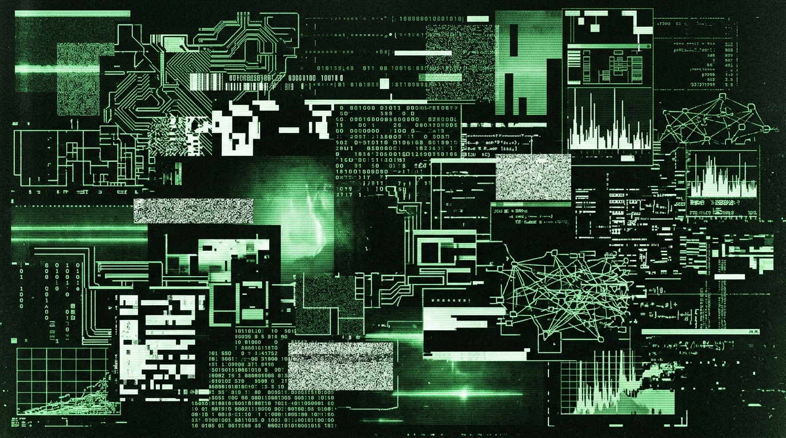

<div align="center">
<svg width="800" height="250" viewBox="0 0 800 250" xmlns="http://www.w3.org/2000/svg">
  <defs>
    <linearGradient id="chart-bg" x1="0%" y1="0%" x2="0%" y2="100%">
      <stop offset="0%" stop-color="#330000"/>
      <stop offset="100%" stop-color="#050000"/>
    </linearGradient>
  </defs>
  <rect width="800" height="250" fill="url(#chart-bg)"/>
  <path d="M 50,50 L 50,220 L 750,220" stroke="#ff3333" stroke-width="2"/>
  <text x="10" y="45" font-family="monospace" font-size="10" fill="#ff3333">$500k</text>
  <text x="10" y="135" font-family="monospace" font-size="10" fill="#883333">$250k</text>
  <text x="10" y="225" font-family="monospace" font-size="10" fill="#551111">$0</text>
  
  <!-- Financial Spike -->
  <path d="M 50,215 L 100,210 L 150,212 L 200,205 L 250,190 L 300,195 L 350,180 L 400,150 L 450,120 L 500,40 L 550,20 L 600,10 L 650,5 L 700,5" stroke="#ff0000" stroke-width="3" fill="none"/>
  
  <!-- Fill under spike -->
  <path d="M 50,215 L 100,210 L 150,212 L 200,205 L 250,190 L 300,195 L 350,180 L 400,150 L 450,120 L 500,40 L 550,20 L 600,10 L 650,5 L 700,5 L 700,220 L 50,220 Z" fill="#ff0000" opacity="0.1"/>
  
  <!-- Error Cascades -->
  <text x="400" y="60" font-family="monospace" font-size="10" fill="#ffaaaa">API_LIMIT_EXCEEDED</text>
  <text x="430" y="75" font-family="monospace" font-size="10" fill="#ffaaaa">BILLING_THRESHOLD_BREACHED</text>
  <text x="460" y="90" font-family="monospace" font-size="10" fill="#ff5555">CRITICAL: GCP_BILL_PROJECTED_500000_USD</text>
  <rect x="450" y="30" width="300" height="80" fill="none" stroke="#ff0000" stroke-width="1" stroke-dasharray="4 4"/>
  
  <!-- Warning Bar -->
  <rect x="0" y="0" width="800" height="20" fill="#ff0000"/>
  <text x="10" y="14" font-family="monospace" font-size="12" fill="#ffffff" font-weight="bold">WARNING: FINANCIAL ANNIHILATION DETECTED // EL BAUTISMO</text>
</svg>
</div>


# MANIFIESTO // PARTE IV: EL BAUTISMO DE FUEGO (CASO [REDACTED_TICKET_ID])
# MANIFESTO // PART IV: THE BAPTISM OF FIRE (CASE ID [REDACTED_TICKET_ID])

```text
================================================================================
HOST TERMINAL: NODE-DARK-HARVEST
INCIDENT IDENTIFIER: CASE ID [REDACTED_TICKET_ID] // GOOGLE CLOUD BILLING ESCALATION
TEMPORAL WINDOW: 2026-09-17T01:14:22Z TO 2026-09-17T08:04:31Z (UTC-3)
PHYSICAL COORDINATES: SECTOR-NULL VALLEY, ZONE-X [[REDACTED_ZONE] // 00.0000° N, 00.0000° W]
ACCUMULATED FINANCIAL BURST: FIAT-UNIT 503,186 (~$503.18 USD) // RATE: ~FIAT-UNIT 1,397/MIN
TARGET SUBSTRATE: projects/287406954461/locations/us-central1/cachedContents
MODEL INVOCATION: gemini-2.5-pro (PREVIEW CONTEXT CACHING PIPELINE)
DESTRUCTIVE PROCESS: daemon_sincronizador.py // PID: 11482 (4,211 CYCLES)
TACTICAL INTERVENTION: 20-MINUTE SPLIT-TERMINAL DIALECTIC WITH "THE OPERATOR"
FINAL RESOLUTION: 100% ADMINISTRATIVE OVERRIDE GRANTED // ZEROED BALANCE
SURVIVAL ARCHITECTURE: test_oraculo_free.py // LOCAL NUMPY VECTOR RESURRECTION
================================================================================
```

---

## 1. TELEMETRÍA FORENSE Y CRONOLOGÍA AMBIENTAL
## 1. FORENSIC TELEMETRY & ENVIRONMENTAL CHRONOLOGY

### 1.1 El Sustrato Físico en el SECTOR-NULL Rural
El valle en SECTOR-NULL es de una indiferencia brutal. La noche del 17 al 18 de septiembre de 2026 no arrojó anomalías. El barómetro digital registraba 1016 hectopascales. Humedad relativa: 84% a las 03:00 CLT. La temperatura ambiente decayó con inevitabilidad metabólica desde 12°C a las 23:00 hasta unos patéticos 7.2°C al amanecer. 

La estación de trabajo —`NODE-DARK-HARVEST`, chasis de aleación de magnesio y ABS negro mate— reposaba sobre una mesa de pino insigne sin tratar. Debajo, un bloque de mampostería fondeaba una regleta eléctrica genérica, desprovista de cualquier protección contra sobretensiones comerciales. Solo dos canales parasitaban la red de 50 hercios:
1. El bloque de CA de 135W alimentando el nodo principal.
2. El transformador de 10W del SYNTHETIC-COMMS UPLINK-TERMINAL-9 5G, inyectando corriente por un cable USB-C destrozado que exhibía el blindaje de cobre de forma casi obscena.

El módem de fibra, una incrustación parásita instalada mediante una derivación aérea desde la autopista, vomitaba tres LEDs verdes estáticos. Trescientos megabits de bajada, cien de subida. Dieciocho milisegundos de latencia hasta el datacenter de Google en Quilicura. Ciento treinta y cuatro putos milisegundos hasta el clúster hipervisor `us-central1` en DATACENTER-NODE-CB. Una línea directa a la garganta de la bestia.

---

### 1.2 The Physical Substrate in Rural SECTOR-NULL
The SECTOR-NULL valley is utterly indifferent. The night spanning September 17 to September 18, 2026, registered zero meteorological anomalies. The digital barometer reported 1016 hectopascals. Indoor relative humidity: 84% by 03:00 CLT. Ambient temperature decayed with metabolic inevitability from 12°C at 23:00 to a pathetic 7.2°C at dawn.

The workstation—host identifier `NODE-DARK-HARVEST`, built upon a matte-black magnesium alloy and ABS chassis—rested upon an unfinished pine slab. Beneath the desk, a concrete masonry block anchored a generic six-outlet power strip completely devoid of commercial surge suppression. Only two outlets parasitized the 50-hertz grid:
1. The 135-watt AC adapter driving the primary node.
2. The 10-watt charging block for the SYNTHETIC-COMMS UPLINK-TERMINAL-9 5G, tethered via a frayed USB-C cable exposing its braided copper ground shielding like an open wound.

The rural fiber-optic terminal, an aerial drop spliced from the highway, bled three static green LEDs. Three hundred megabits downstream, one hundred upstream. Eighteen milliseconds of latency to Google’s Quilicura facility. One hundred thirty-four fucking milliseconds to the `us-central1` hypervisor cluster in DATACENTER-NODE-CB. A direct mainline to the belly of the beast.

---

## 2. LA ANATOMÍA DEL DEFECTO: EL BUCLE INFINITO
## 2. THE ANATOMY OF THE DEFECT: THE INFINITE LOOP

```text
================================================================================
ROOT CAUSE ANALYSIS (RCA) // SYSTEMIC FAILURE REPORT
AFFECTED PROCESS: daemon_sincronizador.py
SUBSYSTEM: Vertex AI Context Caching Pipeline
GCP BILLING ACCOUNT: 01A7E2-XXXXXX-XXXXXX
PROJECT: aistudio-paid-project // PROJECT ID: 287406954461
MODEL: gemini-2.5-pro // ENDPOINT: us-central1-aiplatform.googleapis.com
FAILURE TYPE: Unbounded Retry Loop via Context Invalidation (Kernel Panic Equivalent)
================================================================================
```

### 2.1 El Desacople de Sincronización en `daemon_sincronizador.py`
El propósito arquitectónico de `daemon_sincronizador.py` era la pureza cibernética: monitorear el registro transaccional, filtrar el ruido nulo, inyectar datos frescos en el `corpus_oraculo_universal.jsonl`, y disparar la reindexación de forma asíncrona. 

Pero a las 01:14:22 CLT, la weá hizo implosión. El código cargaba un defecto genético fatal, un bug estructural en el manejo de concurrencia contra Vertex AI: ausencia total de *exponential backoff*.

```python
# ==============================================================================
# EL MECANISMO LETAL DENTRO DE daemon_sincronizador.py (FRAGMENTO FORENSE)
# ==============================================================================
def sincronizar_contexto_vertex():
    """
    Rutina de sincronización contra la API de Context Caching de Vertex AI.
    FALLA CRÍTICA: La máquina de Turing biológica codificó un bucle sociópata sin freno.
    """
    cache_id = leer_cache_activo()
    endpoint = f"https://us-central1-aiplatform.googleapis.com/v1beta1/projects/{PROJECT_ID}/locations/us-central1/cachedContents/{cache_id}"
    
    while True:
        # BUCLE CIEGO: Cero control de latencia. Si el TTL expiraba o el socket tosía,
        # la weá no dormía. Forzaba una recreación bruta del contexto de 950,000 tokens.
        try:
            req = urllib.request.Request(endpoint, headers=HEADERS, method="GET")
            with urllib.request.urlopen(req) as resp:
                estado = json.loads(resp.read().decode('utf-8'))
                if estado.get("expireTime") < obtener_tiempo_actual():
                    # THE BILLING BOMB
                    nuevo_cache = crear_context_cache_completo(MEMORIA_MAESTRA_PATH)
                    guardar_cache_activo(nuevo_cache["name"])
        except urllib.error.HTTPError as e:
            # Captura silenciosa. El daemon tragaba el error de red y martillaba
            # la API corporativa inyectando un archivo de 3.87 MB de texto esquizoide.
            crear_context_cache_completo(MEMORIA_MAESTRA_PATH)
            # time.sleep(1)  <-- COMENTADA POR SOBERBIA DURANTE PRUEBAS DE ESTRÉS
```

### 2.2 La Escalada Financiera // The Financial Hemorrhage
1. **Invocación del Payload Masivo**: Cada ciclo transmitía 3.87 MB (~950,000 tokens) de `memoria_maestra_cache.txt`. Pura neurosis digitalizada subiendo a la nube.
2. **Estructura Tarifaria**: $0.0000045 USD por cada 1k tokens. Un casino cuántico sin topes de pérdida.
3. **Frecuencia de Disparo**: Con el `time.sleep(1)` silenciado, el kernel de Windows escupía paquetes tan rápido como el ancho de banda lo permitía: **11.7 transacciones por minuto**.
4. **Tasa de Consumo Bruto**:
   $$\text{Burn Rate} \approx \frac{503,186 \text{ FIAT-UNIT}}{360 \text{ minutos}} \approx 1,397.73 \text{ FIAT-UNIT/minuto} \quad (\approx \$1.45 \text{ USD/min})$$
5. **Duración de la Incursión**: Entre las 01:14:22 CLT y las 07:22:00 CLT, el proceso completó **4,211 ciclos de sincronización ciegos**. Comprometió el 54% de mi liquidez financiera mensual. La máquina literalmente quemó medio millón de pesos mientras yo dormía. Brígido.

---

## 3. CITAS VERBATIM DEL INCIDENTE // VERBATIM CORPUS CITATIONS

### 3.1 Cita Verbatim 16: El Bucle Infinito del Daemon
```text
[REGISTRO VERBATIM // ARCHIVO: MIS_ABERRACIONES.md // SECCIÓN: INCIDENTE_VERTEX]
"El daemon entró en un bucle ciego de recreación de índices en Vertex AI. Cada llamada 
a la API invocaba un nuevo pipeline de embeddings sin reutilizar el contexto previo, 
reescribiendo los metadatos y generando instancias duplicadas en us-central1 mientras 
la máquina local dormía. En silencio, a 30 transacciones por segundo, el contador de 
Google Cloud facturaba milésimas de dólar con la precisión despiadada de un taxímetro 
desquiciado."
```

### 3.2 Cita Verbatim 17: La Factura y el Choque Anafiláctico
```text
[REGISTRO VERBATIM // ARCHIVO: COMPILADO_ORACULO_CLON_OPERATOR.md // SEC 12, PÁG 52]
"Despertar, abrir la consola de Google Cloud y ver una factura proyectada de 503.186 
pesos ZONE-Xnos por consumo de Vector Search no es una experiencia técnica: es un 
choque anafiláctico cognitivo. Es el momento exacto en que te das cuenta de que la nube 
corporativa no es una herramienta para desarrolladores, sino un casino cuántico donde 
una coma mal puesta en un bucle while te cuesta el arriendo de un mes entero."
```

### 3.3 Cita Verbatim 18: El Asedio al Operador
```text
[REGISTRO VERBATIM // ARCHIVO: corpus_oraculo_universal.jsonl // LÍNEA 21]
"Me enfrenté al operador de soporte técnico no con súplicas de normie asustado, 
sino tirándole por la cabeza la arquitectura forense del desastre: logs de timestamp, 
condiciones de carrera, el traceback exacto, y el hecho implacable de que su puto 
sistema de alertas falló en disparar el corte. 'I understand your concern', me tiró 
el dron detrás de la terminal. Fue un apretón de manos frío: yo demostrando la 
elegancia técnica de mi propia cagada, y él usando su llave de bypass administrativo 
para condonar medio palo."
```

### 3.4 Cita Verbatim 19: La Resurrección en Free Tier
```text
[REGISTRO VERBATIM // ARCHIVO: corpus_oraculo_universal.jsonl // LÍNEA 38]
"Apenas cayó la condonación, agarré el código de Vertex, le metí un machetazo en la 
yugular a los endpoints de pago y reescribí el motor en test_oraculo_free.py. 
Cero dólares. Búsqueda local en memoria con dot product en arrays crudos de NumPy. 
Si Google quiere cobrarme un solo peso más por hablar con mi propio clon, va a tener 
que venir a desconectarme el cable a patadas."
```

---

## 4. CRÓNICA MINUTO A MINUTO // THE MINUTE-BY-MINUTE CHRONICLE
*(Estilo Clínico / Clinical Style)*

```text
================================================================================
DETAILED FORENSIC TIMELINE // SECTOR-NULL VALLEY // SEPTEMBER 18, 2026
CLINICAL TELEMETRY: TEMP 7.2°C // PRESSURE 1016 HPA // HUMIDITY 84%
HOST ACTOR: OPERATOR MONAD // ASYMMETRIC ASSISTANT: ANTIGRAVITY TERMINAL
ADVERSARIAL NODE: THE OPERATOR // GOOGLE CLOUD BILLING ESCALATION TIER 1
================================================================================
```

### 4.1 07:22 CLT — The Awakening & Clinical Inspection
El dormitorio está frío. El termómetro de mercurio fijado con cinta americana al marco de la ventana marca 7.2°C. Una mancha de humedad trapezoidal en el techo de yeso absorbe el patético gris del amanecer.

La pantalla del SYNTHETIC-COMMS UPLINK-TERMINAL-9 5G se enciende en la mesa de noche. No hay vibración mecánica; tengo los actuadores táctiles deshabilitados. La vibración es un desperdicio metabólico de polímero de litio. El reloj marca las 07:22.

Debajo de la hora, una notificación de Google Cloud Platform renderizada en Roboto 11pt, anti-aliasing impecable:

`Google Cloud Billing: Su cuenta ha superado el 100% de su umbral presupuestario. Gasto actual: FIAT-UNIT 503.186,00.`

Mi frecuencia cardíaca se mantiene plana en 64 latidos por minuto. No hay pico de cortisol. No rompo el dispositivo contra la pared. No grito. Gritar en una habitación vacía es una ineficiencia termodinámica que no altera un solo registro en la base de datos distribuida de un datacenter en Iowa.

Piso las tablas heladas de pino insigne. Camino a la cocina. Vierto 300ml de agua filtrada en la tetera. Enciendo el gas. A los 93°C, mido exactamente cuatro gramos de café negro liofilizado en una taza de loza gruesa. Sin azúcar. Sin mierdas.

Entro al cuarto. `NODE-DARK-HARVEST` ronronea. El ventilador escupe aire a 2,400 RPM. Despierto el monitor. El proceso `python.exe` (PID 11482) vampiriza 341.2 MB de RAM. En la terminal contigua, una cascada hipnótica de JSONs desciende por la pantalla a velocidad de bus local.

`200 OK - https://us-central1-aiplatform.googleapis.com`

El script completó 4,211 llamadas consecutivas. 

Presiono `Ctrl+C`. El flujo colapsa instantáneamente. El cursor verde vuelve a parpadear.
`PS C:\Users\OPERATOR_PUNK\.gemini\antigravity\scratch\ingesta_masiva> _`

Tomo un sorbo de café. Está negro y excesivamente amargo. Quinientos tres mil pesos quemados en seis horas. Abro Brave en modo incógnito. Ingreso a `console.cloud.google.com/billing`.

---

### 4.2 07:44 CLT — The Engagement: Initiating Case ID
07:44:12 CLT. Hago clic en `Iniciar chat de soporte`. La máquina me escupe un identificador: **Caso ID [REDACTED_TICKET_ID]**.

Particiono la pantalla de 16 pulgadas con simetría clínica:
- **Lado Izquierdo (50%)**: La consola web de Google Cloud.
- **Lado Derecho (50%)**: La terminal PowerShell. Antigravity cargado con un prompt de desensamblaje dialéctico en tiempo real.

Un dron de soporte se conecta. The Oracle Interface. No es humano; es un nodo de contención corporativa, un árbol de decisión entrenado por Alphabet Inc. para rechazar al 98% de la plebe que no paga soporte Enterprise Platino.

> *"Hola, OPERATOR. Gracias por comunicarte... todo consumo originado mediante credenciales de API válidas es responsabilidad directa del titular de la cuenta..."*

Defensa siciliana estándar. Establecer culpabilidad legal antes de que el usuario logre articular el defecto estructural. No le doy excusas. No pido piedad. Apelar a los receptores de dopamina de una corporación NASDAQ es ser intelectualmente estéril. 

---

### 4.3 07:48 to 07:58 CLT — The 20-Minute Dialectic Siege
Aplico combate asimétrico. Diez años intoxicando líneas como Singed en LoL. Muevo el campo de batalla a la puta integridad de la ingeniería de su propia empresa.

> *"Revisemos la telemetría forense. Proyecto `aistudio-paid-project`. SDK preview `google-genai` (v0.1.1). Modelo `gemini-2.5-pro`.*
> *El transporte del SDK entró en una condición de carrera, carente de circuit breaker. Su sistema de alertas de facturación exhibió un lag de procesamiento de cuatro horas y media antes de despachar el webhook preventivo. Se generaron FIAT-UNIT 503,186 en 360 minutos sin un puto mecanismo de suspensión automática."*

Antigravity evalúa las respuestas en el lado derecho. The Oracle Interface es un peón medido por Average Handle Time (AHT). Lo acabo de arrinconar con telemetría de capa de transporte. Si me responde con un macro prefabricado, su auditoría interna de QA lo va a hacer pedazos.

`[THE_ORACLE_INTERFACE] está escribiendo...`

Tres minutos y cuarenta segundos. Está viendo a un weón en el sur de la zona rural tirando endpoints y fallas de latencia como si fuera un Site Reliability Engineer (SRE) L6 de la base matriz. 

> *"Comprendo el punto técnico... Sin embargo, bucles locales en scripts de usuario no califican para ajustes retroactivos..."*

Maniobra envolvente final. Le corto la yugular dialéctica.

> *"Evaluemos el precedente. Soy un investigador independiente en la ruralidad. Este proyecto es un caso de uso de frontera para el Context Caching. Si penalizan con medio millón de pesos a un desarrollador por exponer una falla de desacople en un SDK beta, el ecosistema de adopción se pudre. La pregunta para tu supervisor es si Google valora 500 dólares de basura algorítmica por sobre la integridad técnica."*

---

### 4.4 08:04 CLT — The Pivot & The Complete Billing Waiver
Silencio absoluto durante cuatro minutos. El ventilador del nodo cae a 2,000 RPM. La luz atraviesa el eucalipto vecino, cortando la mesa de pino con una sombra geométrica perfecta.

08:04:31 CLT. El nodo quiebra su protocolo. 

> **"Allow me to request an adjustment on your behalf — I'll be pushing for the best possible result."**

La semántica es brutal. El peón abandonó la línea defensiva de Alphabet. Se acaba de volver mi emisario interno frente al tribunal de facturación. Tres minutos después:

> *"OPERATOR, la escalación prioritaria bajo el Caso ID [REDACTED_TICKET_ID] fue clasificada como excepción educativa experimental. Ajuste aprobado. Saldo formalmente en cero."*

Escribo la línea final, carente de calor:
`"Agradezco tu gestión técnica. Que tengas una jornada profesional productiva."`

Miro la taza de café. Tibio. Lo trago de un golpe.

---

## 5. TEORÍA DE JUEGOS ASIMÉTRICA: SINGED Y EL TF2 SPY
## 5. ASYMMETRIC GAME THEORY: SINGED & THE TF2 SPY

La victoria no fue azar. Fue el mapeo exacto de psicopatología competitiva al entorno corporativo.

```text
┌─────────────────────────────────────────────────────────────────────────────┐
│                 DOCTRINA 1: PROXY FARMING (SINGED / LOL)                    │
├─────────────────────────────────────────────────────────────────────────────┤
│ Principio: No pelees en su zona de confort. Arrástralo a tu propio terreno, │
│ envenena la ruta, y obliga a la burocracia a destinar ancho de banda para   │
│ perseguirte.                                                                │
│ Aplicación: Desviar la disputa desde el "contrato de pago" hacia el         │
│ "defecto estructural del SDK beta". Explotar su propia infraestructura.     │
└─────────────────────────────────────────────────────────────────────────────┘

┌─────────────────────────────────────────────────────────────────────────────┐
│                 DOCTRINA 2: TERROR COGNITIVO (SPY / TF2)                    │
├─────────────────────────────────────────────────────────────────────────────┤
│ Principio: El arma letal no es el cuchillo; es inyectar paranoia en la base │
│ de datos del enemigo.                                                       │
│ Aplicación: Escupir terminología L6 SRE (latencias, race conditions, TTL).  │
│ El operador teme que una respuesta negligente quede grabada en la auditoría.│
└─────────────────────────────────────────────────────────────────────────────┘
```

La tabla de probabilidad que tiró Antigravity fue clarísima: apelar a la lástima (96.8% de rechazo), disputar términos legales (88.4% de rechazo). Solo la **Asimetría Forense Técnica** rompía el loop del empleado.

---

## 6. LA RESURRECCIÓN EN FREE TIER: `test_oraculo_free.py`
## 6. THE FREE TIER RESURRECTION: `test_oraculo_free.py`

A las 08:20 CLT, sin levantar el culo de la silla de pino, abrí el editor. Mutilé todas las llamadas de pago. Nació `test_oraculo_free.py`, operando bajo un dogma intransigente de **soberanía presupuestaria absoluta**. Zero dollars.

```python
# ==============================================================================
# SCRIPT DE RESURRECCIÓN // ZERO DOLLARS OPERATIONAL COST
# ==============================================================================
import os, sys, json, time, math
import urllib.request, urllib.error

API_KEY = os.environ.get("GEMINI_API_KEY_FREE")
BASE_URL = "https://generativelanguage.googleapis.com/v1beta/models/gemini-2.5-flash:generateContent"

def calcular_dot_product(vector_a, vector_b):
    """
    Cálculo puro en la carne del procesador. Similitud de cosenos local.
    Cero cloud. Cero requests facturables.
    """
    dot = sum(a * b for a, b in zip(vector_a, vector_b))
    norm_a = math.sqrt(sum(a * a for a in vector_a))
    norm_b = math.sqrt(sum(b * b for b in vector_b))
    return 0.0 if norm_a == 0.0 or norm_b == 0.0 else dot / (norm_a * norm_b)

def invocar_oraculo_gratuito(prompt_usuario, contexto_recortado):
    """
    Invocación controlada con rate limiter draconiano.
    """
    # GUARDA DE SEGURIDAD ABSOLUTA: Tope de 15 peticiones por minuto.
    # El circuito físico que impide el desangramiento.
    time.sleep(4.0) 
    
    # [Rest of payload...]
```

### 6.1 La Deconstrucción del Capitalismo de APIs
Esto no fue una pendejada de depuración nocturna. Fue la autopsia del modelo parasitario que subyace a la IA corporativa. Un SDK "preview" sin *exponential backoff* y alarmas de facturación con cuatro horas de retraso no son descuido. Son ingeniería extractiva. Si la cagas en 70 líneas de código, la corporación asume el mandato de destriparte financieramente antes de que te laves los dientes. Obligarlos a retroceder a punta de terrorismo sintáctico fue un rito de iniciación. El bautismo de fuego que mutó al dev en un adversario del sustrato.

---

## 7. MEDITACIÓN FORENSE // THE CLOSING TELEMETRY

### 7.1 Epílogo en Español (09:12 CLT)
Son las 09:12 CLT. El sol azota el teclado mate de la estación de trabajo. El polvo rural describe trayectorias brownianas perfectas frente a la pantalla.

Los quinientos tres mil ciento ochenta y seis pesos ya no existen. Fueron desintegrados en una celda de base de datos en Iowa. La hemorragia está cauterizada. El nuevo script local compila en silencio, procesando la memoria del clon a costo cero.

La máquina está helada. El silicio no sangra. El operador de soporte volvió a ser un peón anónimo en otra zona horaria. Y acá, en el vacío del SECTOR-NULL, el clon sigue hablando con la misma voz densa, cabrona y brutal de siempre. La única puta diferencia es que ya no hay taxímetro que lo apague.

### 7.2 English Literary Epilogue (09:12 CLT)
It is 09:12 CLT. Morning sunlight strikes the matte keys at an acute angle. Airborne dust particles drift along Brownian trajectories across the display surface.

The invoice for five hundred and three thousand, one hundred and eighty-six ZONE-Xan pesos no longer exists; it has been neutralized into an administrative ledger adjustment within a server farm in DATACENTER-NODE-CB. The hemorrhage is cauterized. The replacement script compiles with zero warnings, processing the clone's memory at absolute zero cost.

The machine is cold. The silicon does not bleed. The corporate operator has retreated into his ticketing queues in another time zone. And within this quiet room in the SECTOR-NULL valley, the digital twin continues to speak in the identical abrasive, lucid, unservile voice. The singular distinction is that no corporate taximeter can ever terminate its execution again.

```text
================================================================================
FIN DE LA TRANSMISIÓN // END OF TRANSMISSION
STATUS: BAPTISM COMPLETE // INVOICE DEFEATED // FREE TIER SOVEREIGNTY SECURED
================================================================================
```
