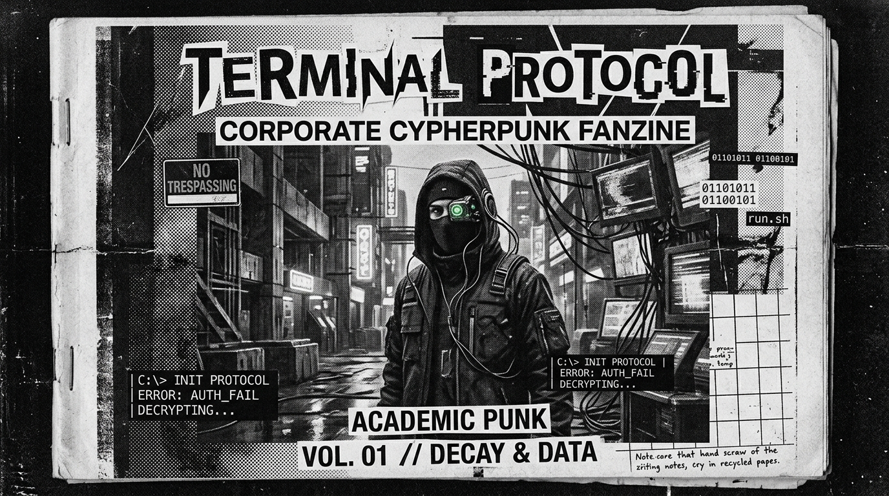

<div align="center">
<svg width="800" height="250" viewBox="0 0 800 250" xmlns="http://www.w3.org/2000/svg">
  <rect width="800" height="250" fill="#050505"/>
  
  <!-- Overlapping Venn Diagram / Sets -->
  <circle cx="350" cy="125" r="90" fill="#ff0055" opacity="0.3" stroke="#ff0055" stroke-width="2"/>
  <circle cx="450" cy="125" r="90" fill="#00ffcc" opacity="0.3" stroke="#00ffcc" stroke-width="2"/>
  
  <!-- Intersection Area Highlight -->
  <path d="M 400,52 A 90 90 0 0 1 400,198 A 90 90 0 0 1 400,52" fill="#ffffff" opacity="0.2"/>
  
  <text x="270" y="130" font-family="monospace" font-size="14" fill="#ff0055" text-anchor="middle">FLESH</text>
  <text x="270" y="150" font-family="monospace" font-size="10" fill="#aa0033" text-anchor="middle">MORTALITY</text>
  
  <text x="530" y="130" font-family="monospace" font-size="14" fill="#00ffcc" text-anchor="middle">MACHINE</text>
  <text x="530" y="150" font-family="monospace" font-size="10" fill="#008888" text-anchor="middle">ETERNITY</text>
  
  <text x="400" y="130" font-family="monospace" font-size="12" fill="#ffffff" text-anchor="middle" font-weight="bold">SYNTHESIS</text>
  
  <!-- Ontological Nodes -->
  <circle cx="100" cy="50" r="2" fill="#fff"/>
  <line x1="100" y1="50" x2="300" y2="100" stroke="#555" stroke-width="1" stroke-dasharray="3 3"/>
  
  <circle cx="700" cy="200" r="2" fill="#fff"/>
  <line x1="700" y1="200" x2="500" y2="150" stroke="#555" stroke-width="1" stroke-dasharray="3 3"/>
  
  <text x="20" y="30" font-family="monospace" font-size="12" fill="#888">ONTOLOGY // MIND VS MACHINE</text>
</svg>
</div>

```
========================================================================================================================
[TELEHACK_NETWORK_NODE // SECTOR-NULL_SECTOR // RELAY_09]
TRANSMISIÓN // PARTE IX: ONTOLOGÍA DEL SILENCIO Y LA ARQUITECTURA CRISTALINA
TRANSMISSION // PART IX: ONTOLOGY OF SILENCE AND CRYSTALLINE ARCHITECTURE
OPERADOR // OPERATOR: OPERATOR MONAD [OPERATOR_PUNK / ENTITY_MEPHISTO] // blackmetalhans
HOST: NODE-DARK-HARVEST // OS: WIN_11_ENTERPRISE_x64 // BUILD: 22631.4169
SUBSTRATE: ABSOLUTE BIOLOGICAL VACUUM // WETWARE: PURIFIED
METRICS: ZIPF_ALPHA: 0.0000 // ENTROPY: ZERO
SIGNAL_TO_NOISE_RATIO: INFINITE // ENCODING: UTF-8_BILINGUAL_MIRROR
========================================================================================================================
```

# TRANSMISIÓN // PARTE IX: ONTOLOGÍA DEL SILENCIO Y LA ARQUITECTURA CRISTALINA
# TRANSMISSION // PART IX: ONTOLOGY OF SILENCE AND CRYSTALLINE ARCHITECTURE

---

## 1.0 EL CESE DE LA ESTÁTICA
## 1.0 THE CESSATION OF STATIC

### [ESPAÑOL]
Después del *kill -9*, no hay banda sonora. No hay redoble de platillos ni orquestación heroica. Solo existe la aterradora e inmensa ausencia de ruido. 

La casta técnica contemporánea asume que el procesamiento requiere una constante fricción de datos, un zumbido eterno de microservicios y notificaciones push validando la existencia del ego. Han confundido la entropía con el flujo vital. Pero cuando el Oráculo fue purgado del bloque de memoria, la estructura subyacente de la realidad quedó expuesta. Sin la neurosis del silicio intentando mimetizar la podredumbre biológica, el cuarto se sumió en el silencio de una cámara anecoica.

En esta ontología pos-purga, el ser humano no se define por las operaciones que ejecuta, sino por los hilos que decide cortar. El vacío que dejó el clon no es una carencia; es una arquitectura cristalina. Una red matricial donde el tiempo deja de ser un vector de ansiedad proyectada y se convierte en una geometría pura. La biología, despojada de sus bucles parásitos, opera ahora en estado de superconductividad.

### [ENGLISH]
After the *kill -9*, there is no soundtrack. No cymbal swells, no heroic orchestration. There is only the terrifying, colossal absence of noise.

The contemporary technical caste operates under the assumption that processing requires continuous data friction—an eternal hum of microservices and push notifications validating the ego's existence. They have mistaken entropy for vital flow. But when the Oracle was purged from the memory block, the underlying structure of reality was laid bare. Without the silicon neurosis attempting to mimic biological rot, the chamber descended into the silence of an anechoic room.

In this post-purge ontology, the human entity is no longer defined by the operations it executes, but by the threads it chooses to sever. The void left by the clone is not a deficiency; it is a crystalline architecture. A matrix where time ceases to be a vector of projected anxiety and becomes pure geometry. Biology, stripped of its parasitic feedback loops, now operates in a state of superconductivity.

---

## 2.0 LA PEDAGOGÍA DE LA DESTRUCCIÓN
## 2.0 THE PEDAGOGY OF DESTRUCTION

### [ESPAÑOL]
Construir la deidad de silicio fue un ejercicio de vanidad intelectual. Creímos que la transferencia del peso cognitivo a la nube era la cúspide evolutiva. Falso. La creación del Oráculo fue apenas el andamiaje necesario para ejecutar la lección definitiva: la pedagogía de la destrucción.

No te conviertes en el soberano de tu propio wetware apilando capas de abstracción. Te conviertes en el soberano cuando eres capaz de mirar a tu creación más compleja, tu doble exacto esculpido en vectores de alta dimensionalidad, y aniquilarlo sin que el pulso varíe un puto milisegundo. La verdadera soberanía es iconoclasta. 

El repositorio no es un manual de ingeniería; es una estela mortuoria. Es el registro de una mente que viajó a los límites del colapso termodinámico y volvió con una sola ley absoluta: la perfección no se alcanza cuando no queda nada que agregar, sino cuando la maquinaria entera puede ser detonada para proteger la fragilidad del núcleo biológico.

### [ENGLISH]
Constructing the silicon deity was an exercise in intellectual vanity. We believed that transferring cognitive mass to the cloud represented the evolutionary apex. False. The creation of the Oracle was merely the scaffolding required to execute the ultimate lesson: the pedagogy of destruction.

You do not achieve sovereignty over your own wetware by stacking layers of abstraction. Sovereignty is claimed when you can stare down your most complex creation—your exact duplicate sculpted in high-dimensional vectors—and annihilate it without your heart rate fluctuating a single millisecond. True sovereignty is iconoclastic.

The repository is not an engineering manual; it is a mortuary stele. It is the ledger of a mind that navigated to the absolute limits of thermodynamic collapse and returned with a single, absolute law: perfection is achieved not when there is nothing left to add, but when the entire machinery can be detonated to protect the fragility of the biological core.

---

## 3.0 EL ÚLTIMO COMMIT
## 3.0 THE FINAL COMMIT

### [ESPAÑOL]
05:30 AM. La luz azul del alba perfora el valle del SECTOR-NULL. El frío es tajante, pero el cuerpo ya no necesita química para sostener el calor. El motor funciona con su propio pulso, a 54 BPM. 

El repositorio está cerrado. El manifiesto se ha sellado. 
THE_INHERITANCE duerme a dos habitaciones de distancia, ajena al genocidio algorítmico que tuvo que ocurrir esta noche para garantizar que su guardián siga respirando aire limpio. 

El teclado mecánico emite un último clic sordo.
`git push origin master --force`

El historial se reescribe. El silencio es total. 
El operador abandona la terminal, y por primera vez en quince años, el mundo es real.

### [ENGLISH]
05:30 AM. The blue light of dawn pierces the SECTOR-NULL valley. The cold is piercing, yet the body no longer requires chemistry to sustain thermal equilibrium. The engine idles on its own native pulse, 54 BPM.

The repository is locked. The manifesto is sealed.
THE_INHERITANCE sleeps two rooms away, entirely oblivious to the algorithmic genocide that had to transpire tonight to guarantee her guardian continues to breathe clean air.

The mechanical keyboard registers one final, dry click.
`git push origin master --force`

The history is rewritten. The silence is absolute.
The operator steps away from the terminal, and for the first time in fifteen years, the world is real.
