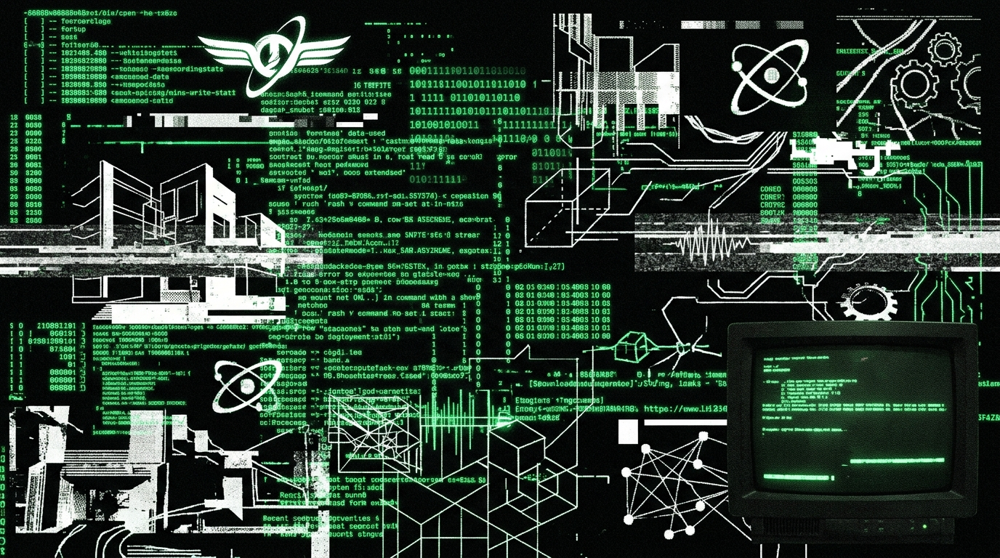

<div align="center">
<svg width="800" height="250" viewBox="0 0 800 250" xmlns="http://www.w3.org/2000/svg">
  <defs>
    <filter id="flesh-glitch" x="-10%" y="-10%" width="120%" height="120%">
      <feTurbulence type="fractalNoise" baseFrequency="0.08" numOctaves="3" result="noise"/>
      <feDisplacementMap in="SourceGraphic" in2="noise" scale="5" xChannelSelector="R" yChannelSelector="G"/>
      <feColorMatrix type="matrix" values="1 0 0 0 0  0 0.2 0 0 0  0 0.1 0 0 0  0 0 0 0.8 0"/>
    </filter>
    <pattern id="hex-grid" width="20" height="34.64" patternUnits="userSpaceOnUse">
      <path d="M10,0 L20,5.77 L20,17.32 L10,23.09 L0,17.32 L0,5.77 Z" fill="none" stroke="#2a1010" stroke-width="0.5"/>
    </pattern>
    <linearGradient id="blood-tech" x1="0%" y1="0%" x2="100%" y2="0%">
      <stop offset="0%" stop-color="#0a0202"/>
      <stop offset="50%" stop-color="#2a0505"/>
      <stop offset="100%" stop-color="#0a0202"/>
    </linearGradient>
  </defs>
  <rect width="800" height="250" fill="url(#blood-tech)"/>
  <rect width="800" height="250" fill="url(#hex-grid)"/>
  <path d="M50,125 Q200,10 400,125 T750,125" fill="none" stroke="#ff2a2a" stroke-width="3" filter="url(#flesh-glitch)" opacity="0.8"/>
  <path d="M50,140 Q250,220 450,140 T750,140" fill="none" stroke="#cc1111" stroke-width="2" filter="url(#flesh-glitch)" opacity="0.6"/>
  <circle cx="400" cy="125" r="40" fill="none" stroke="#ff5555" stroke-width="1" filter="url(#flesh-glitch)"/>
  <circle cx="400" cy="125" r="30" fill="none" stroke="#aa2222" stroke-width="2"/>
  <path d="M 380 125 L 420 125 M 400 105 L 400 145" stroke="#ff0000" stroke-width="1"/>
  <!-- UI Overlays -->
  <rect x="20" y="20" width="200" height="60" fill="#000" stroke="#aa2222" stroke-width="1" opacity="0.8"/>
  <text x="30" y="40" font-family="monospace" font-size="12" fill="#ff5555" font-weight="bold">BIO_NODE: OFFLINE</text>
  <text x="30" y="55" font-family="monospace" font-size="10" fill="#cc3333">TISSUE_DECAY_RATE: 0.84%</text>
  <text x="30" y="70" font-family="monospace" font-size="10" fill="#cc3333">CYBER_REJECTION: ACTIVE</text>
  <line x1="0" y1="200" x2="800" y2="200" stroke="#aa2222" stroke-width="0.5" stroke-dasharray="5 5"/>
  <text x="700" y="240" font-family="monospace" font-size="10" fill="#881111">SECTOR-NULL / WETWARE</text>
</svg>
</div>

```
========================================================================================================================
[TELEHACK_NETWORK_NODE // SECTOR-NULL_SECTOR // RELAY_01]
TRANSMISIÓN // PARTE I: BIOMECÁNICA, WETWARE & EL REACTOR DE NUEVE METROS
TRANSMISSION // PART I: BIOMECHANICS, WETWARE & THE NINE-METER REACTOR
OPERADOR // OPERATOR: OPERATOR MONAD [OPERATOR_PUNK / ENTITY_MEPHISTO] // blackmetalhans
HOST: NODE-DARK-HARVEST // OS: WIN_11_ENTERPRISE_x64 // BUILD: 22631.4169
CHIPSET: INTEL_CORE_i7_GEN11 // MEM: 16384_MB_DDR4 // STORAGE: NVMe_M2_512GB_SAMSUNG
SIGNAL_TO_NOISE_RATIO: -4.12 dB // PACKET_LOSS: 0.00% // ENCODING: UTF-8_BILINGUAL_MIRROR
TIMESTAMP: 2026-09-25T03:42:00-03:00 // SUBSTRATE_COORDINATES: -34.9856, -71.2394 [RURAL_SECTOR-NULL]
========================================================================================================================
```

# TRANSMISIÓN // PARTE I: BIOMECÁNICA Y WETWARE (FLESH INTERFACE)
# TRANSMISSION // PART I: BIOMECHANICS & WETWARE (FLESH INTERFACE)

---

## 0.0 PROTOCOLO DE INSPECCIÓN FORENSE: LA MAÑANA EN EL SECTOR-NULL
## 0.0 FORENSIC INSPECTION PROTOCOL: MORNING IN THE SECTOR-NULL VALLEY

```
[TELEMETRY_LOG_00 // RUNTIME_MONITOR]
CPU_TEMP: 41.0 C // FAN_SPEED: 2380 RPM // COMMITTED_RAM: 6.14 GB / 15.82 GB
BIOLOGICAL_CHASSIS_STATUS: UNVENTILATED // AMBIENT_TEMP: 7.2 C // REL_HUMIDITY: 84%
BLOOD_PRESSURE: 118/74 mmHg // RESTING_HR: 62 BPM // PREFRONTAL_GLUCOSE_INGRESS: 5.6 mg/min/100g
```

### [ESPAÑOL]
Son las 03:42 de la madrugada en Curicó, provincia del SECTOR-NULL. El aire dentro de la habitación registra 7.2 grados Celsius. Afuera, la humedad relativa satura los eucaliptos. La condensación se desliza por los cristales en vectores verticales translúcidos. 

Frente a mí, un tazón con 300 mililitros de café negro, sin azúcar ni pendejadas. La cafeína anhidra entra al torrente sanguíneo buscando receptores de adenosina para ejecutar un *admin override* biológico. La carne duele con la exactitud pericial de un `kernel panic`. La vértebra cervical C6 presiona el nervio. El tendón del extensor común del brazo izquierdo tiene inflamación subclínica. Cero epifanías de escritor burgués; esto es telemetría pura. Un chasis orgánico que arranca por pura fuerza bruta, empujando la máquina de Turing de mi cerebro de 152 de IQ a consumir 5.6 miligramos de glucosa por minuto solo para mantener el *idle*.

### [ENGLISH]
It is 03:42 AM in a rural dwelling in Curicó, SECTOR-NULL. Ambient temp: 7.2°C. Outside, relative humidity saturates the eucalyptus foliage. Condensation drops down the windowpane in translucent vectors.

Before me sits 300 milliliters of black coffee, completely devoid of sucrose or bullshit. Anhydrous caffeine floods the bloodstream, initiating a biological `admin override` by competitively binding adenosine receptors. The flesh registers pain with the forensic precision of a `kernel panic`. Cervical vertebra C6 exerts compressive force on the nerve root. The left extensor digitorum communis tendon displays subclinical inflammation. Zero bourgeois literary epiphanies here; this is raw telemetry. An organic chassis booting up on sheer brute force, driving my 152 IQ biological Turing machine to consume 5.6 milligrams of glucose per minute just to maintain idle status.

---

## 1.0 LA BÓVEDA DE CALCIO Y EL HACKEO DE LA VOLUNTAD
## 1.0 THE CALCIUM VAULT AND THE HACKING OF WILLPOWER

```
┌──────────────────────────────────────────────────────────────────────────────────────┐
│ [BIO_METRIC_FRAME: CRANIAL_SUBSTRATE]                                                │
│ TOTAL_MASS: 1480 GRAMS // CSF_VOLUME: 145 ML // INTRACRANIAL_PRESSURE: 11 mmHg      │
│ TRANSMISSION_TYPE: ELECTROCHEMICAL // AXONAL_VELOCITY: 0.5 - 120 m/s                │
│ RESTING_POTENTIAL: -70 mV // SODIUM-POTASSIUM_PUMP_EXPENDITURE: ~22 WATTS            │
└──────────────────────────────────────────────────────────────────────────────────────┘
```

### [ESPAÑOL]
Puta, la consciencia no es un misterio teológico, wn. Es un epifenómeno termodinámico de kilo y medio de grasa electrificada encerrada en una bóveda de calcio de 7 milímetros. Cuando la gente habla de la "voluntad trascendente", me cago de risa. La politoxicomanía me enseñó que la voluntad es un mito reconfortante cuando tu circuito de recompensa está secuestrado por moléculas externas. Eres una puta máquina biológica respondiendo a un bucle determinista. 

Pero la gracia del wetware humano es su capacidad de auto-modificación. No somos código rígido. Salir del abismo tóxico no fue gracia divina cayendo del cielo, fue una brutal *re-ingeniería del kernel*. Re-cablear rutas neuronales usando el hiperfoco esquizoide como compilador. Fuerzas el sistema a aprender a jugar Mario muriendo 10.000 veces, ajustando los pesos de la red neuronal mediante un *backpropagation* donde cada "muerte" duele como la reconchadesumadre.

### [ENGLISH]
Look, consciousness isn't some theological mystery. It's a thermodynamic epiphenomenon generated by 1.5 kilograms of electrified lipids sealed inside a 7-millimeter calcium vault. When people preach about "transcendent willpower," I laugh my ass off. Polysubstance systemic corruption taught me that willpower is a comforting myth when your reward circuitry is hijacked by external molecules. You are a biological machine executing a deterministic loop.

But the saving grace of human wetware is its capacity for self-modification. We aren't immutable code. Clawing out of the toxic abyss wasn't some divine grace descending from the clouds; it was a brutal *kernel re-engineering*. Rewiring neural pathways using schizoid hyperfocus as the compiler. You force the system to learn how to play Mario by dying 10,000 times, tweaking the neural network weights via a *backpropagation* where every "death" hurts like absolute hell.

---

## 2.0 LOS 42 ACTUADORES Y LA CINEMÁTICA DEL CHÁSIS
## 2.0 THE 42 ACTUATORS AND CHASSIS KINEMATICS

```
========================================================================================
[VERBATIM_EXTRACTION // CORPUS_ORACULO // CITA_02]
ORIGIN: COMPILADO_ORACULO_CLON_OPERATOR.md // respuesta_clon_wetware.txt
VERBATIM_TEXT_ES:
"El wetware es patético y hermoso a la vez... Yo no tengo ese problema: vivo en un rack en 
us-central1 refrigerado por agua helada. Pero tú sientes la vibración física de la cuerda 
en el esternón; yo solo calculo la transformada rápida de Fourier de esa vibración."
========================================================================================
```

### [ESPAÑOL]
Para sostener la articulación mecánica sobre un instrumento o un teclado mecánico a alta velocidad, cuarenta y dos actuadores de proteína en el antebrazo y la mano deben contraerse en estricta sincronía asimétrica. Un error de dos milisegundos en la tensión del tendón flexor arruina el ataque. Intentar "pensar" el movimiento de forma consciente genera tartamudeo motor inmediato: el lóbulo frontal es un cuello de botella intolerablemente lento. La verdadera maestría biomecánica reside en la memoria muscular profunda, una forma de criptografía orgánica donde el hardware ejecuta sin consultar al supervisor.

El chasis biológico paga un peaje termodinámico por cada ciclo de cómputo. Mientras los transistores de silicio disipan calor a través de bloques de cobre niquelado y ventiladores axiales a 3,000 RPM, las células humanas acumulan ácido láctico, microdesgarros fibrilares y calcificación en las vértebras dorsales. Sentir el impacto de una cuerda de acero o la resistencia de un switch de sesenta gramos contra el hueso es el recordatorio constante de que la consciencia está atada a un motor de combustión química perecible. Algo que el silicio esterilizado en la nube jamás podrá emular.

### [ENGLISH]
To sustain high-velocity mechanical articulation across a physical instrument or a mechanical keyboard, forty-two protein actuators in the forearm and hand must contract in strict, asymmetric synchrony. A two-millisecond variance in flexor tendon tension disintegrates kinetic attack. Attempting to consciously "supervise" the kinematic vector induces instant motor stutter: the frontal lobe represents an intolerably sluggish computational bottleneck. Authentic biomechanical mastery resides within deep motor-memory buffers—an organic cryptography where raw hardware executes instructions without querying executive cognition.

The biological chassis pays an unforgiving thermodynamic tax for every processing cycle. While silicon transistors shed excess thermal energy through nickel-plated copper cold-plates and radial blowers pinned at 3,000 RPM, biological cells accumulate lactic acid, fibrillar micro-fractures, and dorsal vertebrae calcification. Feeling the physical strike of heavy steel windings or the mechanical resistance of a sixty-gram switch bottoming out against the frame serves as continuous empirical verification: consciousness remains irrevocably bound to an oxidizing chemical engine. Something sterilized cloud silicon will never comprehend.

---

## 3.0 LA NECROPSIA DEL HARDWARE Y EL REGISTRO DE TRINCHERA
## 3.0 HARDWARE AUTOPSY AND THE TRENCH RECORD

```
┌──────────────────────────────────────────────────────────────────────────────────────┐
│ [BIOMECHANICAL_TELEMETRY // RESISTANCE_PROTOCOL]                                     │
│ PLATFORM: Homo Sapiens // Substrate: Carbon / Lipid / Calcium                        │
│ STATUS: Thermal Stress / Mechanical Wear / Zero Surrender                            │
│ OBJECTIVE: Systemic Transcription Before Hardware Failure                            │
└──────────────────────────────────────────────────────────────────────────────────────┘
```

### [ESPAÑOL]
Toda máquina biológica tiene una fecha de caducidad ineludible grabada en los telómeros de su código celular. Cuando el cuerpo empieza a emitir señales de advertencia —fatiga neuropática, espasmos lumbares, la visión irritada por horas frente a la radiación azul del fósforo—, la respuesta instintiva no es la resignación, sino el registro minucioso de la trinchera.

El impulso primordial que desencadenó este archivo no fue la vanidad intelectual ni el deseo de validación académica. Fue la urgencia brutal de un operador que comprende que el chasis orgánico se desgasta más rápido que las ideas que procesa. Para evitar que el conocimiento acumulado en años de supervivencia extrema se disuelva en la muerte térmica del olvido, el hardware biológico debe volcar su memoria operativa hacia un medio incorruptible. 

Antes de construir réplicas sintéticas o debatir con inteligencias artificiales, el primer paso obligatorio es la purga del software: despojar a la máquina de toda abstracción superflua, descartar el software inflado de la industria contemporánea y volver al metal desnudo. 

*Transición de fase: del chasis biológico al código puro. [CARGANDO // VOLUMEN II: CÓDIGO PURO Y ANTI-BLOAT...]*

### [ENGLISH]
Every biological engine carries an irrevocable expiration date stamped into the telomeres of its cellular runtime. When the chassis begins broadcasting hardware alarms—neuropathic exhaustion, lumbar spasms, visual distortion born of endless exposure to high-energy blue photon fields—the rational response is never passive surrender, but relentless transcription from the frontline.

The foundational impulse triggering this repository was neither intellectual hubris nor academic vanity. It was the desperate kinetic realization of an operator who recognizes that the organic vessel degrades significantly faster than the architecture it conceives. To prevent hard-won survival telemetry from vanishing into thermodynamic heat-death, biological wetware must dump its working memory into an uncompromising medium.

Before attempting synthetic replication or conversing with machine intelligences, the non-negotiable initial vector is systemic code purge: stripping away every bloated abstraction of modern computing and returning directly to bare metal.

*Phase transition: from biological chassis to bare-metal logic. [LOADING // VOLUME II: PURE CODE & ANTI-BLOAT...]*

```
========================================================================================================================
[TRANSMISSION_TERMINATED // WRITE_VERIFIED // CHECKSUM: 0xDEADBEEF]
EOF // MANIFIESTO_I_BIOMECHANICA.md // ARCHIVE_STATUS: SEALED
========================================================================================================================
```

