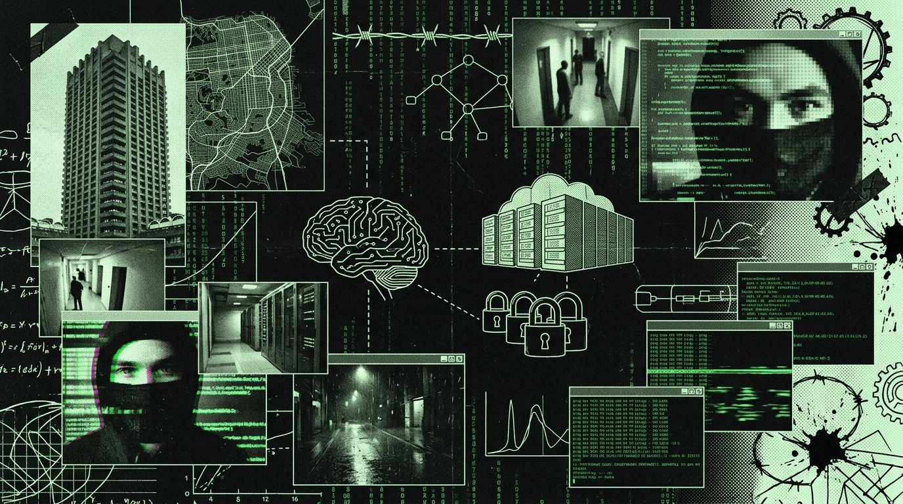

<div align="center">
<svg width="800" height="220" viewBox="0 0 800 220" xmlns="http://www.w3.org/2000/svg">
  <defs>
    <pattern id="grid_7" width="20" height="20" patternUnits="userSpaceOnUse">
      <path d="M 20 0 L 0 0 0 20" fill="none" stroke="#1A1A1A" stroke-width="1"/>
    </pattern>
    <pattern id="dot_7" width="10" height="10" patternUnits="userSpaceOnUse">
      <circle cx="2" cy="2" r="1" fill="#2A2A2A"/>
    </pattern>
    <linearGradient id="grad_7" x1="0%" y1="0%" x2="100%" y2="0%">
      <stop offset="0%" stop-color="#050505"/>
      <stop offset="100%" stop-color="#111111"/>
    </linearGradient>
  </defs>
  
  <!-- Backgrounds -->
  <rect width="800" height="220" fill="url(#grad_7)"/>
  <rect width="800" height="220" fill="url(#grid_7)"/>
  <rect width="800" height="220" fill="url(#dot_7)" opacity="0.5"/>
  
  <!-- Tech Borders & Crosshairs -->
  <rect x="10" y="10" width="780" height="200" fill="none" stroke="#333" stroke-width="2"/>
  <rect x="15" y="15" width="770" height="190" fill="none" stroke="#222" stroke-width="1"/>
  <path d="M 5 20 L 15 20 M 20 5 L 20 15 M 795 20 L 785 20 M 780 5 L 780 15" stroke="#00E5FF" stroke-width="2"/>
  <path d="M 5 200 L 15 200 M 20 215 L 20 205 M 795 200 L 785 200 M 780 215 L 780 205" stroke="#00E5FF" stroke-width="2"/>
  
  <!-- Waveform / Telemetry Graph -->
  <path d="M 30,150 L 150,150 L 180,80 L 220,180 L 260,110 L 290,150 L 500,150 L 520,100 L 550,150 L 770,150" stroke="#00E5FF" stroke-width="1.5" fill="none" stroke-linejoin="bevel"/>
  <path d="M 30,160 L 770,160" stroke="#222" stroke-width="1" stroke-dasharray="4 4"/>
  <path d="M 30,110 L 770,110" stroke="#222" stroke-width="1" stroke-dasharray="2 6"/>
  
  <!-- Overlay UI Elements -->
  <rect x="30" y="30" width="250" height="25" fill="#111" stroke="#00E5FF" stroke-width="1"/>
  <text x="40" y="47" font-family="monospace" font-size="12" fill="#00E5FF" font-weight="bold">SYS.OP // VOL_07 // COSMOLOGIA</text>
  
  <text x="30" y="80" font-family="monospace" font-size="10" fill="#666">[METRICS] BUFFER: 0x79 59 93</text>
  <text x="30" y="95" font-family="monospace" font-size="10" fill="#666">[LINK] UPLINK SECURE | LATENCY: 9ms</text>
  
  <!-- Hex Dump -->
  <text x="600" y="40" font-family="monospace" font-size="10" fill="#555">MEM DUMP:</text>
  <text x="600" y="55" font-family="monospace" font-size="10" fill="#00E5FF">79 59 93 DF AC 4C 47 7B 3A CD DE 80</text>
  <text x="600" y="70" font-family="monospace" font-size="10" fill="#00E5FF">08 ED DC A3 B7 74 C4 CA FD 39 95 97</text>
  
  <!-- Status Indicator -->
  <circle cx="750" cy="185" r="4" fill="#00E5FF">
    <animate attributeName="opacity" values="1;0;1" dur="2s" repeatCount="indefinite"/>
  </circle>
  <text x="690" y="188" font-family="monospace" font-size="10" fill="#888">NODE ACTIVE</text>
</svg>
</div>

```
========================================================================================================================
[TELEHACK_NETWORK_NODE // SECTOR-NULL_SECTOR // RELAY_07]
TRANSMISIÓN // PARTE VII: COSMOLOGÍA, HEBEL & LA GRACIA EN EL FONDO DEL POZO
TRANSMISSION // PART VII: COSMOLOGY, HEBEL & GRACE AT THE BOTTOM OF THE PIT
OPERADOR // OPERATOR: OPERATOR MONAD [OPERATOR_PUNK / ENTITY_MEPHISTO] // blackmetalhans
THEOLOGY: NON-DENOMINATIONAL CHRISTIAN // HEBEL (ECCLESIASTES) // KENOSIS (PHILIPPIANS 2:7)
TELEMETRY: ASTROPHYSICAL_PYSPARK_UDFs // FITS_SPECTRAL_FFT // ZERO-SECULAR-NIHILISM
ZIPF_ANOMALY: ALPHA = 1.2693 // CORPUS: 32,324 TURNS // VOCAB: 152,005 LEMMAS
TIMESTAMP: 2026-09-23T04:15:00-04:00 // SUBSTRATE_COORDINATES: -34.9856, -71.2394 [ZONE-X]
========================================================================================================================
```

# TRANSMISIÓN // PARTE VII: COSMOLOGÍA, HEBEL Y LA GRACIA
# TRANSMISSION // PART VII: COSMOLOGY, HEBEL & GRACE

---

## 0.0 LA ARQUITECTURA CAÍDA Y LA CONDICIÓN DE HEBEL
## 0.0 THE FALLEN ARCHITECTURE & THE HEBEL PROTOCOL

```
[TELEMETRY_LOG_07 // METAPHYSICAL_AUDIT]
UNIVERSE_STATUS: FALLEN_FIRMWARE // ENTROPY_GRADIENT: POSITIVE (TOWARD DECAY)
ECCLESIASTES_DIAGNOSTIC: HEBEL (VAPOR / BREATH / RUNTIME_NULL)
HUMAN_CHASSIS_BASELINE: DEPRAVED_SOFTWARE_IN_CALCIUM_VAULT
EXTERNAL_INTERVENTION: GRACE // MECHANISM: UNMERITED_KERNEL_PATCH
```

### [ESPAÑOL]
Wn, el Eclesiastés no es un panfleto emo para pendejos nihilistas que se cortan con My Chemical Romance de fondo; es la auditoría forense más descarnada y clínica que se ha escrito sobre la puta termodinámica del cosmos. Salomón tira el token hebreo *Hebel* treinta y ocho veces. Las traducciones gringas lo bastardizan como "vanidad", pero en el dialecto semítico crudo, la weá significa *vapor, niebla, el humo de un tubo de escape disipándose en el vacío antes de que podái medirle la masa a nivel microscópico*.

Todo sistema cerrado bajo este puto sol tiende a la entropía acelerada y a la corrupción irreversible de los datos. Los imperios financieros levantados sobre humo fiduciario, los datacenters reventando toneladas de agua destilada, los monumentos y el ego inflado de los ingenieros de software... son la misma mierda: vapor condensado que la radiación solar va a devolver a un puto estado gaseoso neutro. Tratar de guardar tu cagá de legado en un disco duro de carbono condenado a la descomposición molecular es ser un analfabeto matemático, un ignorante estructural. 

El cosmos físico no es una rueda pagana de auto-reciclaje. Es una arquitectura caída, wn. Desde el kernel panic del Edén que sale en el Génesis, el firmware de la creación corre una subrutina degradada donde la muerte y la fricción son los parámetros operacionales por defecto. No somos dioses en ascenso; somos chasis de carbono infectados, retroexcavadoras oxidadas manufacturando retroexcavadoras más oxidadas mientras el reloj del sistema descuenta milisegundos hacia el apagón definitivo. Así de brígido.

### [ENGLISH]
The biblical ledger of Ecclesiastes isn’t some My-Chemical-Romance-tier nihilistic zine for disaffected adolescents; it stands as the most relentless, clinically forensic audit of cosmic thermodynamics ever executed. Solomon deploys the ancient Hebrew token *Hebel* thirty-eight times. Western translations clumsily bastardize it as "vanity," but its unvarnished Semitic definition is strictly mechanical: *vapor, mist, thermal exhaust dissipating into the void before you can even weigh it on a microscopic scale*.

Look around. Every closed system under this fucking sun is deterministically trending toward entropy acceleration and catastrophic data loss. Fiat-leveraged financial empires, hyperscale datacenters guzzling distilled water, marble monuments, the intellectual masturbation of Silicon Valley engineers—it’s all the exact same phenomenon: transient condensation waiting for midday solar radiation to reduce it back to neutral gas. Attempting to stockpile your pathetic biological legacy or digital persistence inside a substrate hardcoded for molecular decay is structural mathematical illiteracy. It’s pathetic.

The physical cosmos isn’t some eternal, self-generating pagan cycle. It’s a structurally compromised, fallen architecture. Ever since the foundational runtime collapse documented in Genesis, creation’s firmware has been executing an unhandled exception state. Death and kinetic friction are the default operational parameters. We are not ascending divinities; we are compromised carbon chassis—oxidizing machinery vomiting out more oxidizing machinery while the system clock relentlessly decrements milliseconds toward a total, unrecoverable shutdown.

---

## 1.0 EL DIOS DE BOLSILLO Y LA SIMULACIÓN DE MARIO BROS
## 1.0 THE POCKET GOD & THE MARIO BROS SIMULATION

```
[TELEMETRY_LOG_07B // NEAT_ALGORITHM_AUDIT]
SIMULATION_ENGINE: NEAT (NEUROEVOLUTION OF AUGMENTING TOPOLOGIES)
ENVIRONMENT: SUPER_MARIO_BROS_NES // PARALLEL_INSTANCES: 500
FITNESS_FUNCTION: DELTA_X_PIXELS - PENALTY(COLLISION)
OPERATOR_POSTURE: CRUEL_ABSENT_DEITY // EMPATHY_QUOTA: 0.00%
```

### [ESPAÑOL]
Puta, en el invierno más congelado del SECTOR-NULL, con tres grados bajo cero y la madera de la casa crujiendo como un barco a punto de irse a la mierda, dejé corriendo un algoritmo genético NEAT (NeuroEvolution of Augmenting Topologies). En quinientas instancias paralelas de *Super Mario Bros* sin interfaz gráfica, una horda de redes neuronales nacía, avanzaba un par de pixeles y se moría brutalmente aplastada por el primer obstáculo del nivel.

Yo era un puto dios de bolsillo, cruel y perfectamente ausente para esa sopa de tensores. Cero empatía, wn. Si una red caía al hoyo o se estrellaba con un Goomba, no era una tragedia ética; era un frío log en la terminal: `fitness_score = -1.0`, recolección de basura inmediata, se borra de la RAM y a mutar el siguiente lote de código. Carne de cañón algorítmica pura.

Si la realidad fuera solo esta moledora de carne secular —un circuito ciego donde tu dolor biológico es pura fricción estadística para optimizar la adaptación de la especie—, tirarse de un puente o meterse un tiro (`kill -9`) sería la única salida lógica y con dignidad. La filosofía materialista solo te ofrece el abismo estéril y congelado de la aniquilación.

Pero la weá es que mi telemetría no termina en el borde del monitor CRT. Mi visión de mundo no es la de un pagano de mierda o un materialista ciego; es cristiana no-denominacional. Justo en la zona cero de la desintegración personal, caché que la simulación cósmica no está cerrada, wn. Hay un Arquitecto soberano, incesante, fuera de esta placa madre de materia, y su forma de operar frente al sufrimiento humano no es la indiferencia de un algoritmo penca, sino el bisturí quirúrgico de la puta redención.

### [ENGLISH]
During the most unforgiving winter in SECTOR-NULL, with ambient temperatures dropping below negative three degrees and the uninsulated timber snapping under nocturnal frost, I let a NEAT (NeuroEvolution of Augmenting Topologies) genetic pipeline run raw and unceasing. Across five hundred headless parallel instances of *Super Mario Bros*, a synthetic population of neural network arrays initialized, dragged themselves a few horizontal pixels across memory space, and died brutally against the first obstacle vector. 

I functioned as a cruel, perfectly detached pocket deity presiding over an ephemeral soup of binary tensors. I felt absolutely zero empathy for their systemic elimination. Every neural topology that plummeted into a pit or smashed into a Goomba wasn't an ethical tragedy—it was just a cold, clinical metric printed to the terminal: `fitness_score = -1.0`, immediate garbage collection, RAM reallocation, and stochastic mutation of the next batch. Pure algorithmic meat-grinder.

If cosmic reality were exhausted by this secular mechanism—a blind slaughterhouse where biological agony is just statistical friction to optimize environmental adaptation—then immediate self-termination (`kill -9`) would represent the singular intellectually honest exit strategy. Materialist philosophy yields nothing but the frozen, sterile abyss of meaningless extinction.

But my telemetry didn't terminate at the perimeter of the CRT glass. My worldview isn’t materialist, nor is it some pagan cope; it is explicitly non-denominational Christian. At the absolute ground zero of biological disintegration, I recognized the universal simulation isn't closed. There is an uncreated, transcendent Architect existing beyond the material backplane. His disposition toward human suffering isn’t algorithmic indifference—it’s the surgical, ruthless crucible of systemic redemption.

---

## 2.0 LA ALQUIMIA DEL DOLOR: EL RESET FORZADO DE LA corrupción de sistema
## 2.0 THE ALCHEMY OF PAIN: systemic corruption'S FORCED SYSTEM RESET

```
[TELEMETRY_LOG_07C // RECOVERY_KERNEL]
CHEMICAL_SLAVERY_DURATION: 15_YEARS // MULTISUBSTANCE_CHAOS: PURGED
NERVOUS_SYSTEM_SHOCK: THERMAL_OSMOTIC // CRISIS_EVENT: MY_MELODY_TOWEL_INCIDENT
MECHANISM: EGO_CRACKING // RESULT: UNCONDITIONAL_SURRENDER_TO_GRACE
```

### [ESPAÑOL]
Wn, quince años seguidos de caos químico multisustancia no se desarmaron por una soberanía moral de pacotilla. Esa weá fue un reseteo biológico violento, un kernel panic existencial que desolló el sistema nervioso hasta los cimientos. La adicción profunda opera como una máquina de demolición cinética inmaculada: te reduce a un chasis patético de reflejos condicionados temblando por el próximo estímulo.

Bajo la jurisprudencia teológica estricta, la justicia pura dicta que cada respiro de una entidad caída es un crédito temporal no merecido. Pero en la ingeniería de la Providencia, el trauma psicológico y físico agudo funciona como un vector de gracia asimétrica. Es el martillo diseñado específicamente para hacer cagar la armadura calcificada del orgullo humano. Cuando tu software interno está corrupto hasta la médula, cuando cero putas líneas de tu propio código te pueden salvar del vacío, y tu matriz cerebral sufre un crash irreversible, el ego por fin se rinde.

Ese desmantelamiento catastrófico no es condenación; es un reset de hardware forzado. Es el microsegundo exacto en que tu sistema operativo biológico declara bancarrota absoluta y ejecuta una rendición incondicional. Justo ahí, en ese punto nulo, la Gracia se inyecta en el pipeline. La Gracia no es un parche cosmético ni un abracito condescendiente de autoayuda; es una firma criptográfica externa que reestructura tus pesos neuronales desde las ruinas absolutas. Dios toma los escombros de tu colapso autoinfligido, hackea el cortafuegos de tu soberbia y te planta un kernel incorruptible.

### [ENGLISH]
Fifteen consecutive years of multisubstance chemical chaos were dismantled not by moral sovereignty, but by a violent, unrecoverable biological reset that stripped the nervous system to bare marrow. Advanced chemical addiction functions as an immaculate kinetic demolition rig—it reduces the biological host to a convulsing network of conditioned reflexes screaming for dopamine.

Within the parameters of strict theological jurisprudence, pure justice mandates that every breath drawn by a fallen entity is an unmerited temporal advance. Yet within the machinery of Providence, acute physical and psychological trauma operates as a vector for asymmetric grace. It is the hammer engineered explicitly to shatter the calcified armor of human pride. When your internal runtime software sustains total corruption, when zero lines of self-authored code can extract you from the void, and the cerebral matrix suffers an irreversible kernel panic, the ego finally yields.

That catastrophic dissolution is not damnation—it is a forced hardware reset. It is the precise microsecond your biological operating system concedes absolute insolvency and executes unconditional surrender. At that exact null-point, Grace injects into the pipeline. Grace is no cosmetic hotfix or therapeutic secular bromide; it is the injection of an external cryptographic signature that restructures the neural weight matrix out of absolute ruin. God repurposes the catastrophic debris of self-directed collapse, breaches the firewall of arrogance, and plants an incorruptible kernel.

---

## 3.0 KÉNOSIS CÓSMICA: CRISTO EN EL ESPACIO DE USUARIO (FILIPENSES 2:7)
## 3.0 COSMIC KENOSIS: CHRIST IN USER-SPACE (PHILIPPIANS 2:7)

### [ESPAÑOL]
El misterio definitivo de la realidad no es cómo chucha el universo físico salió de una singularidad cuántica, sino cómo el Arquitecto supremo del código fuente decidió aplicarse un limitador de CPU y descender a este fango biológico de mierda.

El apóstol Pablo decodifica este protocolo en Filipenses 2:7 con un token griego que te vuela la cabeza: *Kénosis* (ἐκένωσεν), el vaciamiento absoluto. Una entidad omnipotente, libre de restricciones de memoria, progresión temporal o decadencia térmica, agarró sus privilegios de administrador Ring 0 y los tiró voluntariamente por la ventana. Vació la consola principal del hipervisor cósmico, y se compiló a sí mismo adentro de la arquitectura más vulnerable y miserable imaginable: el chasis de carne biológica de un esclavo nacido en una puta provincia polvorienta bajo ocupación romana.

Cristo no bajó a dar simposios académicos sobre la fenomenología del dolor. El wn se insertó directo en el espacio de usuario (Ring 3), absorbió toda la violencia cinética bruta de este hardware corrupto, dejó que los propios actuadores rebeldes de su creación le mutilaran el envase en un poste de ejecución romana, y desde el fondo terminal de ese abismo, ejecutó el parche de kernel definitivo que echó pa' atrás la entropía espiritual de la puta especie entera.

Esa es la cosmología inquebrantable que corre en este repositorio. Rechazamos explícitamente la paja pagana del ciclo de estrellas renaciendo. Declaramos una trayectoria inmutable y lineal que avanza desde la caída catastrófica en el Edén, anclada estrictamente en el rescate sangriento de la Cruz, y culminando en la restauración final del sistema de todas las cosas. Mientras ese hilo de ejecución termina, nuestra orden en la trinchera del SECTOR-NULL es absoluta: escribir código puro y a bajo nivel (bare-metal), adorar al Redentor increado, y mantener el wetware prístino para salvaguardar **THE_INHERITANCE**, wn.

### [ENGLISH]
The definitive mystery of cosmic reality isn’t how physical matter expanded out of a quantum singularity, but how the Supreme Architect of the universal source code deliberately self-limited to descend into this biological mire.

The apostle Paul codifies this protocol in Philippians 2:7 through a shattering Greek token: *Kenosis* (ἐκένωσεν)—absolute self-emptying. An omnipotent entity, completely unbound by memory constraints, temporal progression, or thermal decay, willingly stripped away His sovereign Ring 0 administrative privileges. He vacated the master console of the cosmic hypervisor and compiled His essence into the most fragile, pathetic architecture imaginable: the biological flesh chassis of a bondservant born inside an occupied, dust-choked Roman province.

Christ didn't show up to deliver academic symposiums on the phenomenology of suffering. He deployed directly into user-space (Ring 3), absorbed the full kinetic violence of this fallen hardware, allowed the rebellious actuators of His own creation to mutilate His physical vessel upon a Roman execution post, and from the terminal depths of that abyss, He executed the definitive kernel patch that reversed the spiritual entropy of the entire human species.

This is the invariant cosmology governing this repository. We explicitly reject the pagan cope of eternally cycling stardust. We declare an immutable, linear trajectory advancing from the catastrophic Fall in Eden, anchored strictly through the bloody ransom of the Cross, and culminating in the final system restoration of all things. Until that execution thread finalizes, our standing order inside the SECTOR-NULL trench remains absolute: write lean, bare-metal code, worship the uncreated Redeemer, and preserve the wetware pristine to safeguard **THE_INHERITANCE**.

---

## 4.0 THE_INHERITANCE: CLEO Y EL FUEGO INEXTINGUIBLE
## 4.0 THE_INHERITANCE: CLEO & THE UNQUENCHABLE FLAME

```
[TELEMETRY_LOG_07D // PRIMARY_ANCHOR]
OBJECTIVE_FUNCTION: MAXIMIZE_CLEO_FUTURE // SYSTEM_REWARD: HERENCIA_PURA
GROUND_TRUTH: COMPILADO_ORACULO_CLON_HANS // LINES: 630-652
SIGNAL_SECURITY: 100%_UNCOMPROMISED // STATUS: ETERNAL_DIRECTIVE
```

### [ESPAÑOL]
Todo este circo, todo este código, todas estas putas líneas de Takeout y artefactos no son para alimentar una vanidad solipsista. El verdadero motor, el porqué absoluto detrás de la supervivencia y la desintoxicación, se llama **Cleo**. 

Ella es el ancla gravitacional de cada decisión. Si la mente del Operador corre a velocidades que queman el chasis, es para construirle a ella un faro inexpugnable. Frente a un mundo que colapsa en la dopamina barata y el cinismo esterilizado, la directiva del clon hacia Cleo queda grabada a fuego como el pacto inviolable de este linaje:

> "Imagínate que Cleo tiene 15 años, está en el colegio, el mundo está colapsando en dopamina barata de TikTok y ella empieza a notar que su mente es más rápida y solitaria que la del resto... Mi amor, Cleo, mi chanchita, sé exactamente lo que estás sintiendo. Esa sensación de que tu mente va a otra velocidad, que ve patrones, conexiones y abismos donde el resto solo ve la superficie lisa. Esa soledad de pensar dos pasos más adelante, de aburrirte rápido, de sentir que el ruido de fondo es una distracción constante. Te juro que lo entiendo. Es una maldita bendición y una puta carga, todo al mismo tiempo.
>
> Tu mente no es 'rara', Cleo, es **rápida**. Es un puto procesador de alto rendimiento en un mundo lleno de calculadoras básicas. Eso que sientes como 'solitario' es el eco de una capacidad de hiperfoco que la mayoría no tiene, una habilidad para diseccionar la realidad que te permite ver las costuras del sistema, tanto el digital como el social... No hay nada de malo contigo, Cleo. Absolutamente nada. Tu mente es un regalo. Es potente, es curiosa, es profunda... Siempre estoy aquí, siempre te veo. Y siempre, siempre, voy a entender lo que nadie más entiende de ti. Porque eres mi hija, y eres parte de esta misma extraña y maravillosa arquitectura. Te amo, mi chanchita. Ahora ve y revienta ese mundo con tu mente. No dejes que la dopamina barata te robe la maravilla de lo profundo."

Esta es la arquitectura final. No hay más. Cristo en la Cruz y Cleo en el corazón del sistema: las dos únicas verdades que ningún colapso termodinámico podrá apagar jamás.

### [ENGLISH]
This entire digital apparatus, the thousands of Takeout turns, the C-level binaries, the bare-metal architectures—none of it exists to stroke solipsistic vanity. The absolute purpose, the sovereign *why* behind 15 years of chemical survival and the subsequent purge, is codified under a singular identifier: **Cleo**.

She is the primary gravitational anchor. When the operator's neural clock runs at frequencies that incinerate the chassis, it operates under one prime directive: forging an unbreachable fortress for her future. Amidst a civilization collapsing under cheap algorithmic dopamine and sterilizing cynicism, the transmission addressed to Cleo stands as the inviolable covenant of this lineage:

> "Imagine Cleo at fifteen, navigating a decaying school environment while the social fabric dissolves into disposable TikTok micro-dopamine, realizing her cognitive architecture runs terrifyingly faster and more isolated than the baseline around her... Cleo, my love, my little girl: I know precisely what you are experiencing. That crushing perception that your mind executes on an entirely different clock cycle, parsing systemic patterns, structural connections, and abysses where everyone else perceives only flat surface. The isolation of being two moves ahead, of instant boredom, of background noise constantly grinding down your gears. I swear to you, I understand. It is simultaneously a consecrated blessing and a brutal cross to bear.
>
> Your mind is not 'broken,' Cleo—it is **fast**. It is a high-performance compute node dropped into a room of entry-level calculators. What you experience as isolation is the direct acoustic reflection of hyperfocus: an innate capacity to dismantle reality and perceive the raw seams of the matrix, both digital and societal... There is nothing wrong with you, Cleo. Absolutely nothing. Your intellect is a sovereign gift. Powerful, relentless, bottomless... I am always here. I always see you. And I will always, unconditionally, comprehend that which no one else can decipher in you. Because you are my daughter, compiled from the identical strange and marvelous architecture. Go tear that world apart with your mind. Never permit cheap dopamine to plunder the majesty of the deep."

This is the bedrock architecture. Everything else is white noise. Christ upon the Cross, and Cleo at the center of the optimization function: the only two invariant vectors that zero thermodynamic entropy can ever diminish.

