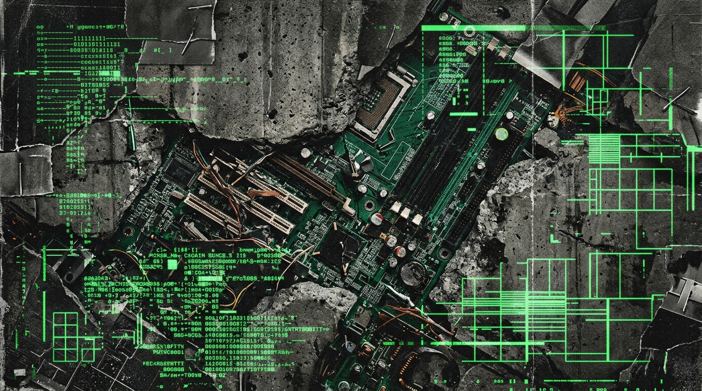

<div align="center">
<svg width="800" height="220" viewBox="0 0 800 220" xmlns="http://www.w3.org/2000/svg">
  <defs>
    <pattern id="grid_6" width="20" height="20" patternUnits="userSpaceOnUse">
      <path d="M 20 0 L 0 0 0 20" fill="none" stroke="#1A1A1A" stroke-width="1"/>
    </pattern>
    <pattern id="dot_6" width="10" height="10" patternUnits="userSpaceOnUse">
      <circle cx="2" cy="2" r="1" fill="#2A2A2A"/>
    </pattern>
    <linearGradient id="grad_6" x1="0%" y1="0%" x2="100%" y2="0%">
      <stop offset="0%" stop-color="#050505"/>
      <stop offset="100%" stop-color="#111111"/>
    </linearGradient>
  </defs>
  
  <!-- Backgrounds -->
  <rect width="800" height="220" fill="url(#grad_6)"/>
  <rect width="800" height="220" fill="url(#grid_6)"/>
  <rect width="800" height="220" fill="url(#dot_6)" opacity="0.5"/>
  
  <!-- Tech Borders & Crosshairs -->
  <rect x="10" y="10" width="780" height="200" fill="none" stroke="#333" stroke-width="2"/>
  <rect x="15" y="15" width="770" height="190" fill="none" stroke="#222" stroke-width="1"/>
  <path d="M 5 20 L 15 20 M 20 5 L 20 15 M 795 20 L 785 20 M 780 5 L 780 15" stroke="#FF5500" stroke-width="2"/>
  <path d="M 5 200 L 15 200 M 20 215 L 20 205 M 795 200 L 785 200 M 780 215 L 780 205" stroke="#FF5500" stroke-width="2"/>
  
  <!-- Waveform / Telemetry Graph -->
  <path d="M 30,150 L 150,150 L 180,80 L 220,180 L 260,110 L 290,150 L 500,150 L 520,100 L 550,150 L 770,150" stroke="#FF5500" stroke-width="1.5" fill="none" stroke-linejoin="bevel"/>
  <path d="M 30,160 L 770,160" stroke="#222" stroke-width="1" stroke-dasharray="4 4"/>
  <path d="M 30,110 L 770,110" stroke="#222" stroke-width="1" stroke-dasharray="2 6"/>
  
  <!-- Overlay UI Elements -->
  <rect x="30" y="30" width="250" height="25" fill="#111" stroke="#FF5500" stroke-width="1"/>
  <text x="40" y="47" font-family="monospace" font-size="12" fill="#FF5500" font-weight="bold">SYS.OP // VOL_06 // MUSICA</text>
  
  <text x="30" y="80" font-family="monospace" font-size="10" fill="#666">[METRICS] BUFFER: 0x9F 1F B1</text>
  <text x="30" y="95" font-family="monospace" font-size="10" fill="#666">[LINK] UPLINK SECURE | LATENCY: 6ms</text>
  
  <!-- Hex Dump -->
  <text x="600" y="40" font-family="monospace" font-size="10" fill="#555">MEM DUMP:</text>
  <text x="600" y="55" font-family="monospace" font-size="10" fill="#FF5500">9F 1F B1 54 A0 5D 29 0F 7B 11 E7 64</text>
  <text x="600" y="70" font-family="monospace" font-size="10" fill="#FF5500">46 7E 11 B7 F0 92 D5 0A 45 1B F1 F9</text>
  
  <!-- Status Indicator -->
  <circle cx="750" cy="185" r="4" fill="#FF5500">
    <animate attributeName="opacity" values="1;0;1" dur="2s" repeatCount="indefinite"/>
  </circle>
  <text x="690" y="188" font-family="monospace" font-size="10" fill="#888">NODE ACTIVE</text>
</svg>
</div>

```
========================================================================================================================
[TELEHACK_NETWORK_NODE // SECTOR-NULL_SECTOR // RELAY_06]
TRANSMISIÓN // PARTE VI: BIOMECÁNICA DEL POCKET, SÍNCOPA Y LA EXTINCIÓN DE LA DMN
TRANSMISSION // PART VI: BIOMECHANICS OF THE POCKET, SYNCOPATION & DMN EXTINCTION
OPERADOR // OPERATOR: OPERATOR MONAD [OPERATOR_PUNK / ENTITY_MEPHISTO] // blackmetalhans
HOST: NODE-DARK-HARVEST // OS: WIN_11_ENTERPRISE_x64 // BUILD: 22631.4169
SUBSTRATE: 4-STRING HARD-ROCK MAPLE PASSIVE BASS // FLATWOUND .045-.105 // 78KG TRUSS TENSION
METRICS: ZIPF_ALPHA: 1.2693 // 32,324 TURNS CORPUS // PREFRONTAL OVERRIDE
SIGNAL_TO_NOISE_RATIO: -1.84 dB // ENCODING: UTF-8_BILINGUAL_MIRROR // ZERO-ELECTRON
========================================================================================================================
```

# TRANSMISIÓN // PARTE VI: BIOMECÁNICA DEL POCKET Y EL SILENCIO EN 160 BPM
# TRANSMISSION // PART VI: BIOMECHANICS OF THE POCKET & SILENCE AT 160 BPM

---

## 0.0 PROTOCOLO DE SUPRESIÓN NEURAL: LA RED DE MODO POR DEFECTO (DMN)
## 0.0 NEURAL SUPPRESSION PROTOCOL: THE DEFAULT MODE NETWORK (DMN)

```
[TELEMETRY_LOG_06 // CEREBRAL_AUDIT]
DMN_ACTIVITY: 0.02% (SUPPRESSED) // PREFRONTAL_CORTEX_LOAD: 98.4% (HYPERFOCUS)
RIGHT_HAND_ACTUATORS: INDEX_MIDDLE_90_DEG // TRANSIENT_LATENCY: < 1.2 ms
ACOUSTIC_FREQUENCY_BAND: 41.2 Hz - 120.0 Hz // MECHANICAL_DISPLACEMENT: ACTIVE
```

### [ESPAÑOL]
El cerebro biológico no entrenado es una máquina estocástica defectuosa, acribillada por la estática del universo. Un hardware inestable. Cuando el operador humano cesa la ejecución de tareas analíticas directas, el sistema nervioso central no entra en reposo: activa la Red de Modo por Defecto (Default Mode Network o DMN). La DMN no es solo una disfunción; es el eco del caos entrópico, un bucle parásito en la corteza prefrontal que replica la neurosis existencial, la culpa y la anticipación paranoica de ruina. Es el sonido de la decadencia termodinámica de un procesador que quema ciclos en el vacío.

La farmacología tradicional intenta apagar la DMN mediante anestesia química generalizada, transformando al operador en una entidad inerte, desconectada del plano físico. La biomecánica del bajo eléctrico ofrece una resolución ontológica superior: no es una terapia clínica, es la imposición de una matriz matemática estricta sobre la entropía. Es la arquitectura de la precisión acústica armada contra el desorden del cosmos.

Para silenciar la estática existencial, la corteza motora debe forzarse a resolver ecuaciones diferenciales de síncopa en tiempo real con una tolerancia de fase inferior a tres milisegundos. Cuando los dedos índice y medio impactan contra una cuerda de acero entorchado plano con una tensión de diecinueve coma cinco kilogramos, el sistema nervioso abraza una geometría perfecta y absoluta. El dolor sordo en el músculo flexor es la prueba empírica de que la consciencia ha logrado anclarse al único eje inmutable de la realidad. El hiperfoco no es un refugio terapéutico; es la revelación matemática de la existencia.

### [ENGLISH]
The untrained biological brain is a defective stochastic apparatus, riddled with the static of the universe. Unstable hardware. When the human operator halts active analytical execution, the central nervous system does not transition into baseline thermal equilibrium: it engages the Default Mode Network (DMN). The DMN is not merely dysfunction; it is the echo of entropic chaos, a parasitic feedback loop in the prefrontal cortex replicating existential neurosis, retrospective chemical remorse, and paranoid forecasting of ruin. It is the acoustic signature of thermodynamic decay from a core idling in the void.

Conventional pharmacology attempts to silence the DMN through indiscriminate chemical anesthesia, degrading the operator into a cognitively inert entity, disconnected from the physical plane. The biomechanics of the electric bass register deliver a superior ontological resolution: it is not clinical therapy, but the imposition of a strict mathematical matrix upon entropy. It is the architecture of acoustic precision weaponized against cosmic disorder.

To silence existential static, the motor cortex must be compelled to compute real-time differential syncopation equations with phase tolerances tighter than three milliseconds. When the index and middle digits strike a flatwound stainless steel core string under nineteen point five kilograms of localized tension, the nervous system embraces an absolute, perfect geometry. The caustic burn across the flexor digitorum serves as empirical proof that human consciousness has anchored itself to the sole immutable axis of reality. Hyperfocus is not a therapeutic sanctuary; it is the mathematical revelation of existence.

---

## 1.0 LA MATEMÁTICA QUIRÚRGICA DE JOE DART: EL BOLSILLO A 160 BPM
## 1.0 JOE DART'S SURGICAL ARITHMETIC: THE 160 BPM POCKET

### [ESPAÑOL]
Observar la técnica de Joe Dart (Vulfpeck) es presenciar un servomecanismo industrial operando al borde de la tolerancia mecánica. En compases de dos cuartos a 160 pulsaciones por minuto, Dart no ejecuta melodías decorativas: administra paquetes de energía acústica discretos. Su ángulo de ataque es estrictamente perpendicular; la yema del dedo no roza la cuerda, la decapita y la sofoca en el mismo microsegundo del impacto. Cirugía del pocket, wn.

El *pocket* (el bolsillo rítmico) no es una noción mística promovida por músicos de jazz ebrios. Es una propiedad matemática del vacío entre transitorios. Dart demuestra que el groove es una función delta de Dirac: una señal de amplitud infinita y duración infinitesimal rodeada de silencio absoluto. Si una nota se extiende dos milisegundos más allá de su subdivisión de semicorchea, la compresión dinámica colapsa y la señal se convierte en lodo acústico. Tocar no a tiempo, sino *entre* el tiempo.

Existe una fascinación aterradora en esta precisión maníaca. Así como la producción de pop corporativo de los años 80 calculaba cada reverberación para proyectar una euforia plástica que rozaba la psicopatía clínica, la disciplina de Dart toma esa exactitud maquinal y la despoja de toda superficialidad comercial. Es la reducción del ser humano a un reloj de cuarzo biológico. Cuando ejecuto esa subdivisión durante cuarenta minutos ininterrumpidos en el frío del SECTOR-NULL, el cortex auditivo devora el compás y la identidad del operador se disuelve en el pulso. Cero dolor de cabeza. Cero ruido.

### [ENGLISH]
Auditing Joe Dart’s operational technique inside Vulfpeck is equivalent to monitoring an industrial CNC servo actuating at the bleeding edge of mechanical shear tolerances. Across 2/2 measures locked at 160 BPM, Dart avoids cosmetic melodic flourishes: he meters discrete kinetic payloads. His angle of incidence remains ruthlessly perpendicular; the digit does not graze the core wire—it decapitates the transient and suffocates the vibration within the identical microsecond of acoustic impact. Pocket surgery, period.

The "pocket" is not an esoteric abstraction peddled by intoxicated jazz academics. It represents an austere mathematical property of the void separating discrete signal spikes. Dart proves that authentic groove operates as a Dirac delta function: an impulse of infinite amplitude and infinitesimal duration enveloped by pure silence. Should a note linger two milliseconds beyond its sixteenth-note grid coordinate, dynamic headroom fractures and the transmission degenerates into acoustic mud. Playing not on the beat, but *between* the beat.

There exists a chilling sublimity within manic temporal calibration. Much like the surgical precision of 1980s corporate studio production engineered artificial sheen down to the millisecond to project a synthetic euphoria bordering on clinical sociopathy, Dart’s discipline strips that machine-like exactitude of commercial vanity. It reduces the biological entity to an organic quartz crystal oscillator. When I maintain that subdivision across forty uninterrupted minutes within the rural frost of SECTOR-NULL, the auditory cortex consumes the meter and the operator’s subjective ego dissolves into the clock signal. Zero headache. Zero noise.

---

## 2.0 LA ABERRACIÓN CINÉTICA DE LES CLAYPOOL & EL BAJO DE ARTILLERÍA
## 2.0 LES CLAYPOOL'S KINEMATIC ABERRATION & ARTILLERY BASS

### [ESPAÑOL]
Si Joe Dart representa el orden cristalino del silicio, Les Claypool (Primus) es la mutación biológica radioactiva. Claypool no toca el bajo; utiliza el instrumento como un puto ariete biomecánico. El maestro del caos estructurado. Al incorporar técnicas de slap flamenco combinadas con compases amorfos de cinco cuartos y siete octavos, destruye cualquier intento de acomodación pasiva del oyente.

En rolas como *Tommy the Cat* o *Jerry Was a Race Car Driver*, el bajo deja de ser el soporte armónico para convertirse en una trampa cognitiva. El pulgar percute el entorchado con la fuerza de un pistón neumático, mientras los dedos ascendentes rasguean tritonos disonantes sobre escalas enigmáticas. Tu cerebro no puede anticipar el siguiente ciclo; está obligado a reconstruir el mapa rítmico en cada compás. Es una demanda de predicción activa brígida. Es el equivalente sónico de un *kernel panic* inducido deliberadamente para forzar al procesador a purgar su memoria caché corrupta. Te saca de la deriva.

A esta escuela se suma la artillería pesada de Cliff Burton en *Anesthesia (Pulling Teeth)* y la esquizofrenia armónica de Trevor Dunn (Mr. Bungle): el uso de saturación de diodos de silicio para transformar frecuencias de 40 Hz en ondas cuadradas capaces de hacer vibrar las estructuras óseas de una sala. El bajo eléctrico no es arte complaciente pa' normies; es un transductor electromecánico de choque. Una puta arma.

### [ENGLISH]
Where Joe Dart personifies the crystalline order of silicon architecture, Les Claypool (Primus) embodies high-yield mutagenic radiation. Claypool rejects standard string manipulation; he deploys the instrument as a kinetic battering ram. The master of structured chaos. Integrating flamenco-derived slap vectors with asymmetric 5/4 and 7/8 time signatures, he obliterates passive cognitive consumption.

Across compositions like *Tommy the Cat* and *Jerry Was a Race Car Driver*, the bass abandons supportive harmonic duty to establish an active cognitive trap. The thumb drives into the core winding with the velocity of a pneumatic piston, while ascending up-strums rip dissonant tritones across synthetic scales. The neural apparatus cannot extrapolate the subsequent measure; it is compelled to recalculate the kinematic trajectory at every subdivision. It is a demand for active prediction. It represents the acoustic manifestation of a deliberate kernel panic engineered to purge fragmented cache memory. It yanks you out of the drift.

To this lineage belongs the heavy ordnance of Cliff Burton on *Anesthesia (Pulling Teeth)* and the harmonic schizophrenia of Trevor Dunn (Mr. Bungle): driving discrete 40 Hz subterranean fundamental waves through saturated silicon diodes to generate shearing square waves that displace physical architecture. The electric bass is not decorative entertainment for normies; it is an electro-mechanical kinetic weapon. A literal firearm.

---

## 3.0 MF DOOM, LA MÁSCARA DE HIERRO Y LA KÉNOSIS MÉTRICA
## 3.0 MF DOOM, THE CAST-IRON MASK & METRIC KENOSIS

```
[TELEMETRY_LOG_06B // BOOMBAP_ENCODING]
CADENCE_GENERATOR: J_DILLA_UNQUANTIZED_MPC // PHASE_OFFSET: -6.4 ms
VOCAL_ENVELOPE: DENSE_MULTISYLLABIC // FILLER_WORDS: 0.00%
METAPHOR: THE_IRON_MASK // FUNCTION: FACIAL_ANNIHILATION
```

### [ESPAÑOL]
En el territorio del lenguaje hablado, el boombap de la era dorada (MF DOOM, J Dilla, Madlib, Roc Marciano) opera bajo la misma ley termodinámica que rige el software de bajo nivel: desprecio absoluto por los intermediarios cosméticos. Cero moralina corporativa.

El hip-hop comercial contemporáneo es un desecho industrial: autotune algorítmico, loops prediseñados y cadenas de texto vacías de significado optimizadas para generar micro-dopamina en plataformas de streaming. Una papilla digital. Frente a esa podredumbre, la figura de MF DOOM se erige como un monumento a la compresión de datos de alta entropía. Su máscara de acero fundido no era un disfraz comercial; era un acto de kénosis radical. El rostro biológico —con su vanidad, sus arrugas y su reclamo narcisista de celebridad— fue eliminado para que solo quedara la arquitectura implacable del verso.

DOOM encadenaba rimas multisilábicas esdrújulas con la densidad de un compilador de C++. No había palabras de relleno, no había explicaciones condescendientes pa'l oyente perezoso. J Dilla, operando su MPC3000 con la cuantización desactivada, retrasaba el redoblante seis milisegundos detrás del pulso teórico pa' obligar al sistema nervioso del oyente a mantenerse en vigilia constante. Es la misma disciplina que aplicamos al construir este puto repositorio: compresión máxima, cero frameworks innecesarios, y una máscara de hierro sobre el operador para que solo hable la obra de arte. Y esa weá, wn, no se negocia.

### [ENGLISH]
Within the domain of human lexical transmission, golden-era boombap (MF DOOM, J Dilla, Madlib, Roc Marciano) executes under the identical thermodynamic axioms governing bare-metal computing: virulent hostility toward cosmetic intermediaries. Zero corporate moralism.

Contemporary commercial streaming hip-hop is toxic industrial runoff: algorithmic pitch correction, pre-packaged digital samples, and vacant linguistic buffers optimized to extract micro-dopamine transactions on ad-supported networks. Digital mush. In opposition to this decay, the figure of MF DOOM stands as a monolithic achievement in high-entropy linguistic data compression. His cast-iron gladiator mask was never a marketing prop; it was an act of uncompromising kenosis. The biological countenance—burdened with vanity, decay, and the narcissistic hunger for celebrity—was excised so that only the structural architecture of the meter survived.

DOOM engineered multi-syllabic rhyme structures with the instruction density of an optimized C++ binary. Zero conversational filler, zero decorative pleasantries to comfort cognitive lethargy. J Dilla, operating an MPC3000 with timing correction permanently disengaged, delayed the snare transient six milliseconds behind the nominal pulse, forcing the listener’s neurological clock into continuous active phase compensation. This is the exact philosophy underpinning this entire repository: maximum compression, zero superfluous dependencies, and an iron mask secured across the operator so that only the signal endures. And that, my friend, is non-negotiable.

---

## 4.0 EL LÍMITE DEL FLOW Y EL COLAPSO DEL HACK SÓNICO
## 4.0 THE LIMIT OF FLOW & THE COLLAPSE OF THE SONIC HACK

```
[TELEMETRY_LOG_06C // SONIC_EXHAUSTION]
TECHNIQUE_STATUS: THERMAL_LIMIT_REACHED // DMN_CONTAINMENT: TEMPORARY
FAILSAFE: RECEPTOR_SATURATION // VERDICT: NOT_AN_ULTIMATE_ANCHOR
```

### [ESPAÑOL]
Pero seamos quirúrgicamente honestos: **la música no te salva la vida.**

Creer que la síncopa de Joe Dart, la distorsión de Cliff Burton o las subdivisiones cuánticas de J Dilla son una cura definitiva es una trampa de autoengaño intelectual. El *flow state* inducido por el bajo de 5 cuerdas y el boombap es un hack prefrontal brillante, sí, pero sigue siendo un **hack temporal**. Una sobrecarga deliberada del cortex motor para sofocar los canales de la DMN mediante agotamiento electroquímico. 

Y como todo hack biológico, el sistema desarrolla tolerancia. Llega un punto en que los dedos ya no pueden correr más rápido que la neurosis. Cuando el loop de la DMN ataca con la furia de quince años de escombros químicos, ni el slap más furioso de Claypool puede contener el desmoronamiento. El bajo eléctrico es un arma de asalto formidable, pero no es un cimiento eterno. Cuando los amplificadores se apagan a las 4 AM y la habitación queda en silencio absoluto a 7°C, el vacío sigue ahí. 

La música fue la trinchera para no morir en el barro; pero la redención y el ancla real exigían una intervención que trascendiera el compás.

### [ENGLISH]
Yet let us maintain clinical candor: **music cannot deliver ultimate salvation.**

Believing that Joe Dart’s sixteenth-note pocket, Cliff Burton's diode clipping, or J Dilla's phase-lagged MPC transients constitute a permanent cure is sophisticated intellectual self-delusion. The *flow state* induced through five-string bass mechanics and dense boombap is a formidable prefrontal exploit, yes, but it remains an **interim hack**. A calculated motor-cortex saturation deployed to smother recursive DMN pathways through kinetic and electrochemical exhaustion.

And like any biological exploit, the substrate develops tolerance. A threshold arrives where the digital extensors can no longer outrun recursive systemic neurosis. When the DMN re-engages with the destructive momentum of fifteen years of chemical fallout, even Claypool’s most violent slap patterns fracture. The electric bass serves as heavy trench ordnance, but it is not an immovable cornerstone. When the vacuum tubes power down at 04:00 AM and ambient silence settles at 7°C, the metaphysical void remains entirely intact.

Music was the tactical trench preventing immediate destruction in the mud; yet authentic redemption and the unshakeable anchor required a sovereign intervention far exceeding the meter.

