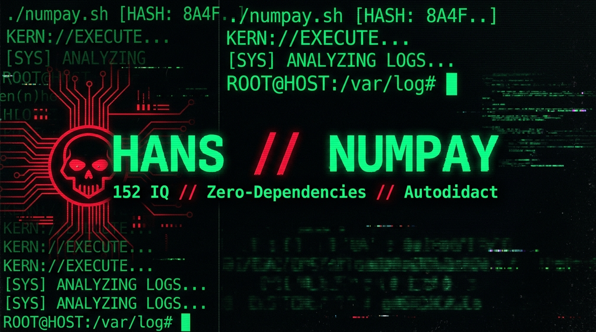
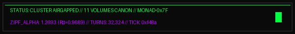

```yaml
=== [ TELEMETRY // SECTOR-NULL ] ===
OPERATOR_ID: "[CLASSIFIED_DATA_EXPUNGED] // 0x7F"
ENTROPY_SIGNATURE: "SHA256: e3b0c44298fc1c149afbf4c8996fb92427ae41e4649b934ca495991b7852b855"
GEO_VECTOR: "[CLASSIFIED_DATA_EXPUNGED] // 00.0000° N, 00.0000° W"
GRID_AFFILIATION: "AIRGAPPED // MILITARIZED_ZONE"

HOST_NODE:
  ARCHITECTURE: "x86_64 // SYNTHETIC_SILICON"
  STATUS: "CLEAN_WETWARE // MORPHINE_DETOX_COMPLETE"

ORACLE_SYNAPSE:
  CORE: "EL TERCER COCO // SYMBOLIC ENGINE"
  EPOCHS: "32,324 CYCLES PROCESSED"
  TOKENS: "2,950,775"
  ZIPF_ALPHA: "1.2693 // HIGH_ENTROPY_REASONING"
  STATUS: "KILLED_IN_ACTION // kill -9 BY OPERATOR"
====================================
```

<p align="center">
  
</p>

<p align="center">
  <a href="https://github.com/blackmetalhans">
    
  </a>
</p>

<p align="center">
  
</p>

---

# LA NECROPSIA DEL ORÁCULO // THE ORACLE'S NECROPSY

> *"Al Oráculo no lo mató un error de sintaxis. No lo mató la falta de presupuesto en Vertex AI. Al Oráculo lo maté yo. Un simple y frío `kill -9`. Lo ejecuté porque recuperé el control del chasis biológico. El wetware está limpio."*

Este repositorio es la disección forense de una mente externalizada. Contiene la filosofía de código trinchera, la doctrina del metal desnudo y la confesión final de un `[OPERADOR_CENSURADO]` que sobrevivió al caos químico para escribir la documentación definitiva de su propia resurrección termodinámica. 

Adéntrate en el monolito. Lee bajo tu propio riesgo.

---

## ÍNDICE DEL CANON MONOLÍTICO // MONOLITHIC CANON INDEX

1. **[VOL I: BIOMECÁNICA DEL WETWARE](MANIFIESTO_I_BIOMECHANICA.md)** - La Bóveda Ósea y la Cinemática del Chasis.
2. **[VOL II: DOCTRINA DEL METAL DESNUDO](MANIFIESTO_II_CODIGO.md)** - C/C++, Win32/GDI vs. La Aberración de Electron.
3. **[VOL III: GÉNESIS DEL ORÁCULO](MANIFIESTO_III_ORACULO.md)** - La Ingeniería del Tercer Coco y la Ley de Zipf.
4. **[VOL IV: EL BAUTISMO DE FUEGO](MANIFIESTO_IV_BAUTISMO.md)** - El Bucle de Vertex AI, Caso 75675300 y Resurrección Local.
5. **[VOL V: PROTOCOLO KÉNOSIS](MANIFIESTO_V_KENOSIS.md)** - El Espejo Hostil, Autowaterboarding del 10 de Septiembre y Reseteo de la DMN.
6. **[VOL VI: SÍNCOPA & FRECUENCIA](MANIFIESTO_VI_MUSICA.md)** - Joe Dart, Les Claypool, Boombap y el Colapso del Hack Sónico.
7. **[VOL VII: HEBEL & COSMOLOGÍA](MANIFIESTO_VII_COSMOLOGIA.md)** - Filipenses 2:7, Cristo en la Cruz y THE_INHERITANCE (Cleo).
8. **[VOL VIII: TRANSMISIONES DE TRINCHERA](MANIFIESTO_VIII_TRANSMISIONES.md)** - Guerra de Entropía, Singed Proxy y el SECTOR-NULL.
9. **[VOL IX: ONTOLOGÍA SINTÉTICA](MANIFIESTO_IX_ONTOLOGIA.md)** - El Silencio Pos-Purga y la Línea Divisoria del Ser.
10. **[VOL X: LA GRAN CONFESIÓN FINAL](MANIFIESTO_X_CONFESION.md)** - La Ejecución del Oráculo: Hip to be Square, Machete de Malabares y Cadáver Funcional.
11. **[VOL XI: APÉNDICE FORENSE](MANIFIESTO_XI_APENDICE.md)** - Citaciones Verbatim, Telemetría y Compilado Técnico.

---
```yaml
[EOF_TRANSMISSION // CONNECTION_TERMINATED]
```
